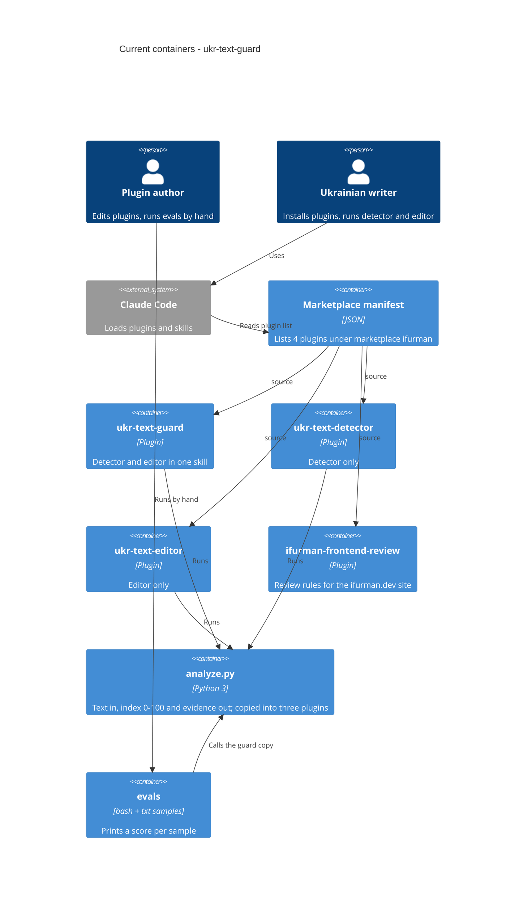

# Architecture map — ukr-text-guard

> The **current** architecture (what exists today), produced by `survey` and read by
> specify / design / data-model / implement. Refresh with `survey` when the repo drifts past
> `reflects_commit`. This is generated; a hand-maintained `docs/architecture.md`, if present, is
> authoritative and reconciled below — not replaced.

## Stack

- Language / runtime: Python 3, standard library only (`html`, `json`, `re`, `statistics`, `sys`, `zipfile`, `collections`); `.docx` is read through `zipfile`, optional `python-docx` (`plugins/ukr-text-guard/skills/ukr-text-guard/scripts/analyze.py:1-12`)
- Shell: one bash script, `evals/run.sh`
- Frameworks: none. The product is Claude Code plugin content (SKILL.md prompts, reference markdown, one script), published through a marketplace manifest (`.claude-plugin/marketplace.json`)
- Build / test / lint: **none exist** (no Makefile, no package or Python manifest, no CI workflow). The only check is the manual `bash evals/run.sh`, which prints one score line per sample and asserts nothing (`evals/run.sh:1-7`)

## C4 — system as it is

## Module inventory

| Module | Path | Layers | Wired at | Responsibility |
|---|---|---|---|---|
| Marketplace | `.claude-plugin/marketplace.json` | manifest | `marketplace.json:13` (`plugins[]`, `metadata.pluginRoot` = `./plugins`) | Lists 4 plugins by name and `source` path |
| ukr-text-guard | `plugins/ukr-text-guard/` | SKILL.md + 4 references + script | `.claude-plugin/plugin.json`, `skills/ukr-text-guard/SKILL.md:38-40` | Detector and editor in one skill; the superset |
| ukr-text-detector | `plugins/ukr-text-detector/` | SKILL.md + 2 references + script | `.claude-plugin/plugin.json` | Detector only |
| ukr-text-editor | `plugins/ukr-text-editor/` | SKILL.md + 3 references + script | `.claude-plugin/plugin.json` | Editor only |
| ifurman-frontend-review | `plugins/ifurman-frontend-review/` | SKILL.md only | `.claude-plugin/plugin.json` | Review rules for an external site; unrelated to the text tools |
| Evals | `evals/` | script + 10 samples | `evals/run.sh:5-6` | Loops over `evals/samples/*.txt`, calls the guard copy of `analyze.py`, prints the first output line |

Each plugin holds exactly one skill, laid out as `plugins/<name>/.claude-plugin/plugin.json` and `plugins/<name>/skills/<name>/SKILL.md`.

## Conventions (cited — the rules a new feature must match)

- **Module wiring / registration:** a plugin is listed in `.claude-plugin/marketplace.json` (`name`, `source`, `description`, `category`, `tags`) and declares itself in its own `plugin.json` (`name`, `displayName`, `version`, `author`, `repository`, `license`, `keywords`); names must match — `plugins/ukr-text-guard/.claude-plugin/plugin.json:1-18`
- **Skill definition:** SKILL.md with frontmatter `name` + `description` (long Ukrainian trigger prose) — `plugins/ukr-text-guard/skills/ukr-text-guard/SKILL.md:1-4`
- **Script invocation:** relative `python3 scripts/analyze.py <file>` (also `-` for stdin, `--json`), no environment variables — `plugins/ukr-text-guard/skills/ukr-text-guard/SKILL.md:38-40`
- **Error handling / IDs / persistence / migrations / inter-module communication:** not applicable; analysis is stateless and there is no datastore
- **Tests:** none automated. Samples are named `human-*` or `ai-*` in kebab case, and expected values are noted only as a category label in the README table (`README.md`, section «Перевірка») — `evals/samples/`
- **Commits:** conventional prefixes (`feat:`, `chore:`, `test:`) — see `git log`
- **Language:** product content and README are Ukrainian; JSON output keys of `analyze.py` are Ukrainian (`індекс`, `рівень`, `метрики`, `кліше`) with a few English metric names such as `MATTR`
- **UI / styling:** none; no frontend in this repo

## Datastores

| Store | Engine | Accessed via | Notes |
|---|---|---|---|
| none | none | none | Text in, report out; nothing is persisted |

## Frontend / UI foundation

<!-- N/A: no frontend -->

`ifurman-frontend-review` carries review rules for the external site ifurman.dev; the site itself is not in this repo.

## Where things live / closest precedents

- A change to detection logic or scoring → `scripts/analyze.py` (scoring around lines 438-507, metrics around 395-435), currently **three byte-identical copies** (see debt below).
- A change to a rule list or style guide → `references/*.md` in each plugin that carries the file.
- A new check or sample → `evals/samples/<human|ai>-<descriptor>.txt`, then `bash evals/run.sh`.
- A new plugin → a new `plugins/<name>/` tree modelled on `plugins/ukr-text-detector/` (smallest one) plus an entry in `.claude-plugin/marketplace.json`.

## Constraints & known tech-debt

- **Duplicated files across plugins** (verified by hash at this commit):
  - `scripts/analyze.py` (578 lines) is identical in guard, detector and editor.
  - `references/syntax-figures.md` is identical in all three.
  - `references/ai-markers.md` is identical in guard and detector.
  - `references/lexicon.md` and `references/style-toolkit.md` are identical in guard and editor.
  - The guard plugin is the superset. Any fix must be made in 2-3 places today.
- **Marketplace installs copy each plugin folder**, so files outside a plugin directory are not available at run time; shared code cannot be referenced across plugins, each plugin needs its own physical copy. Symlinks are unreliable on Windows.
- **Plugin names are already installed by users**: renaming or merging plugins breaks installs.
- **`evals/run.sh` hard-codes the guard copy** and asserts nothing; the README table gives observed indices, not expected ranges, so there is no pass/fail signal.
- **No CI, no test runner, no dependency manifest.**
- **Eval human set is small**: 2 human and 8 AI samples (`evals/samples/`); the human samples are all by one author.

## Reconciliation with the authored architecture doc

No authored architecture doc (`docs/architecture.md`, `ARCHITECTURE.md` or `CLAUDE.md` in the repo); this map is the current reference. `docs/idea-brief.md` (idea `ukr-text-guard-quality`) is consistent with it: the duplication, the unmeasured detector and the absence of CI are the same facts recorded here.
