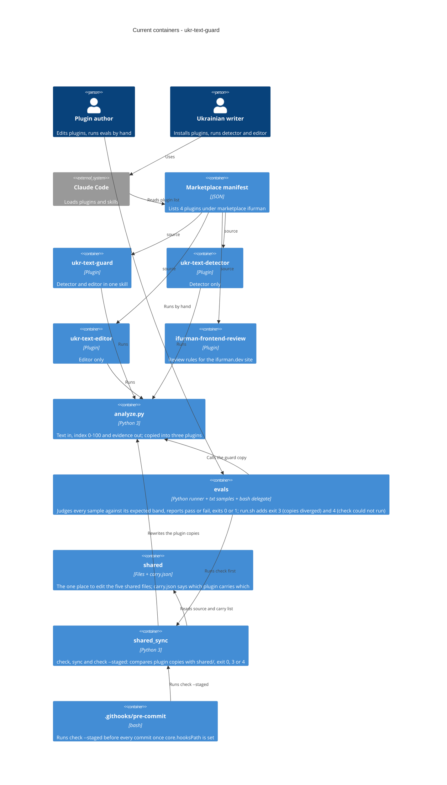

# Architecture map — ukr-text-guard

> The **current** architecture (what exists today), produced by `survey` and read by
> specify / design / data-model / implement. Refresh with `survey` when the repo drifts past
> `reflects_commit`. This is generated; a hand-maintained `docs/architecture.md`, if present, is
> authoritative and reconciled below — not replaced.

## Stack

- Language / runtime: Python 3, standard library only (`html`, `json`, `re`, `statistics`, `sys`, `zipfile`, `collections`); `.docx` is read through `zipfile`, optional `python-docx` (`plugins/ukr-text-guard/skills/ukr-text-guard/scripts/analyze.py:1-12`)
- Shell: one thin bash delegate, `evals/run.sh`, which finds a working Python, runs the copy check (`tools/shared_sync.py check`) first and then calls the runner, and the `.githooks/pre-commit` hook, which runs `check --staged`. The sync tool itself, `tools/shared_sync.py` (`check`, `sync`, `check --staged`), is Python, standard library only
- Frameworks: none. The product is Claude Code plugin content (SKILL.md prompts, reference markdown, one script), published through a marketplace manifest (`.claude-plugin/marketplace.json`)
- Build / test / lint: **none exist** (no Makefile, no package or Python manifest, no CI workflow). The detector check is `bash evals/run.sh`: it first runs the copy check, then the runner, which judges every sample against an expected band, prints a report and exits 0 or 1 (the shell entry point adds exit 3 for diverged copies and 4 when the check could not run; a direct `python evals/run_eval.py` skips the copy check). Tests: `python -m unittest discover evals/tests` for the runner (`evals/run_eval.py`, `evals/tests/test_run_eval.py`) and `python -m unittest discover tools/tests` for the sync tool, the hook and the shell entry point

## C4 — system as it is

## Module inventory

| Module | Path | Layers | Wired at | Responsibility |
|---|---|---|---|---|
| Marketplace | `.claude-plugin/marketplace.json` | manifest | `marketplace.json:13` (`plugins[]`, `metadata.pluginRoot` = `./plugins`) | Lists 4 plugins by name and `source` path |
| ukr-text-guard | `plugins/ukr-text-guard/` | SKILL.md + 4 references + script | `.claude-plugin/plugin.json`, `skills/ukr-text-guard/SKILL.md:38-40` | Detector and editor in one skill; the superset |
| ukr-text-detector | `plugins/ukr-text-detector/` | SKILL.md + 2 references + script | `.claude-plugin/plugin.json` | Detector only |
| ukr-text-editor | `plugins/ukr-text-editor/` | SKILL.md + 3 references + script | `.claude-plugin/plugin.json` | Editor only |
| ifurman-frontend-review | `plugins/ifurman-frontend-review/` | SKILL.md only | `.claude-plugin/plugin.json` | Review rules for an external site; unrelated to the text tools |
| Shared source | `shared/` | 4 reference files + `scripts/analyze.py` + `carry.json` | `shared/carry.json` (read by `tools/shared_sync.py`) | The one place to edit shared detector and rule files; `carry.json` lists the plugins that carry each file |
| Sync tool | `tools/` | script + unit tests | `tools/shared_sync.py` (`main`), `evals/run.sh`, `.githooks/pre-commit` | `check` (working folder), `check --staged` (Git index) and `sync`; reports differing, missing, unlisted and line-ending-only copies, exits 0, 3 or 4; `sync` rewrites diverged copies and deletes nothing |
| Pre-commit hook | `.githooks/` | bash | `git config core.hooksPath .githooks` (one-time per clone) | Refuses a commit whose staged content holds a diverged copy, and a commit when the check cannot run |
| Evals | `evals/` | runner + delegate (runs the copy check first) + known-gap list + unit tests + 10 samples | `evals/run_eval.py` (`main`), `evals/run.sh` | Classifies `evals/samples/*.txt` by the `human-` / `ai-` prefix, analyses each sample in a fresh process with the chosen plugin's copy of `analyze.py` (`--plugin`, default `ukr-text-guard`), judges it against the bands, excuses only the AI samples named in `evals/known-gaps.txt`, prints the report and exits 0 or 1 |

Each plugin holds exactly one skill, laid out as `plugins/<name>/.claude-plugin/plugin.json` and `plugins/<name>/skills/<name>/SKILL.md`.

## Conventions (cited — the rules a new feature must match)

- **Module wiring / registration:** a plugin is listed in `.claude-plugin/marketplace.json` (`name`, `source`, `description`, `category`, `tags`) and declares itself in its own `plugin.json` (`name`, `displayName`, `version`, `author`, `repository`, `license`, `keywords`); names must match — `plugins/ukr-text-guard/.claude-plugin/plugin.json:1-18`
- **Skill definition:** SKILL.md with frontmatter `name` + `description` (long Ukrainian trigger prose) — `plugins/ukr-text-guard/skills/ukr-text-guard/SKILL.md:1-4`
- **Script invocation:** relative `python3 scripts/analyze.py <file>` (also `-` for stdin, `--json`), no environment variables — `plugins/ukr-text-guard/skills/ukr-text-guard/SKILL.md:38-40`
- **Error handling / IDs / persistence / migrations / inter-module communication:** not applicable; analysis is stateless and there is no datastore
- **Tests:** `unittest` tests for the eval runner (`evals/tests/test_run_eval.py`, run with `python -m unittest discover evals/tests`) and for the sync tool, the pre-commit hook and `evals/run.sh` (`tools/tests/`, run with `python -m unittest discover tools/tests`); the detector itself has none. Samples are named `human-*` or `ai-*` in kebab case, and the category comes from that prefix; the expected bands are named constants in `evals/run_eval.py` — `evals/samples/`
- **Commits:** conventional prefixes (`feat:`, `chore:`, `test:`) — see `git log`
- **Language:** product content and README are Ukrainian; JSON output keys of `analyze.py` are Ukrainian (`індекс`, `рівень`, `метрики`, `кліше`) with a few English metric names such as `MATTR`
- **UI / styling:** none; no frontend in this repo

## Datastores

| Store | Engine | Accessed via | Notes |
|---|---|---|---|
| none | none | none | Text in, report out; nothing is persisted |

## Frontend / UI foundation

<!-- N/A: no frontend -->

`ifurman-frontend-review` carries review rules for the external site ifurman.dev; the site itself is not in this repo.

## Where things live / closest precedents

- A change to detection logic or scoring → edit **`shared/scripts/analyze.py`** (scoring around lines 438-507, metrics around 395-435), then run `python tools/shared_sync.py sync`. The three plugin copies are overwritten by the shared source, so a direct edit of a copy is lost and reported by the check.
- A change to a rule list or style guide → edit `shared/references/<file>.md`, then run the sync. `shared/carry.json` says which plugin carries which shared file.
- Copy check → `python tools/shared_sync.py check` (working folder); `.githooks/pre-commit` runs `check --staged` (Git index) once `git config core.hooksPath .githooks` is set in the clone. `evals/run.sh` is the only eval path that performs the divergence check; a direct run of `evals/run_eval.py` does not.
- A new check or sample → `evals/samples/<human|ai>-<descriptor>.txt`, then `bash evals/run.sh` (a direct `python evals/run_eval.py` skips the divergence check); a bypass sample the detector is known to miss is added to `evals/known-gaps.txt`.
- A new plugin → a new `plugins/<name>/` tree modelled on `plugins/ukr-text-detector/` (smallest one) plus an entry in `.claude-plugin/marketplace.json`.

## Constraints & known tech-debt

- **Duplicated files across plugins, now kept equal by a shared source** (`shared/`, ADR-0003):
  - `scripts/analyze.py` is carried by guard, detector and editor; `references/syntax-figures.md` by all three; `references/ai-markers.md` by guard and detector; `references/lexicon.md` and `references/style-toolkit.md` by guard and editor (`shared/carry.json`).
  - The copies still exist in each plugin, because an installed plugin cannot read outside its own folder. Edit only `shared/`, then run `python tools/shared_sync.py sync`; the check fails on any copy that differs byte for byte.
  - The guard plugin is the superset.
- **Marketplace installs copy each plugin folder**, so files outside a plugin directory are not available at run time; shared code cannot be referenced across plugins, each plugin needs its own physical copy. Symlinks are unreliable on Windows.
- **Plugin names are already installed by users**: renaming or merging plugins breaks installs.
- **The eval measures one detector copy per run**; `bash evals/run.sh` is the only eval path that first checks that the three copies are identical (a direct `python evals/run_eval.py` does not); the README table still gives observed indices, not the expected bands.
- **No CI and no dependency manifest**; the eval and its unit tests are run by hand.
- **Eval human set is small**: 2 human and 8 AI samples (`evals/samples/`); the human samples are all by one author.

## Reconciliation with the authored architecture doc

No authored architecture doc (`docs/architecture.md`, `ARCHITECTURE.md` or `CLAUDE.md` in the repo); this map is the current reference. `docs/idea-brief.md` (idea `ukr-text-guard-quality`) is consistent with it: the duplication, the unmeasured detector and the absence of CI are the same facts recorded here.
