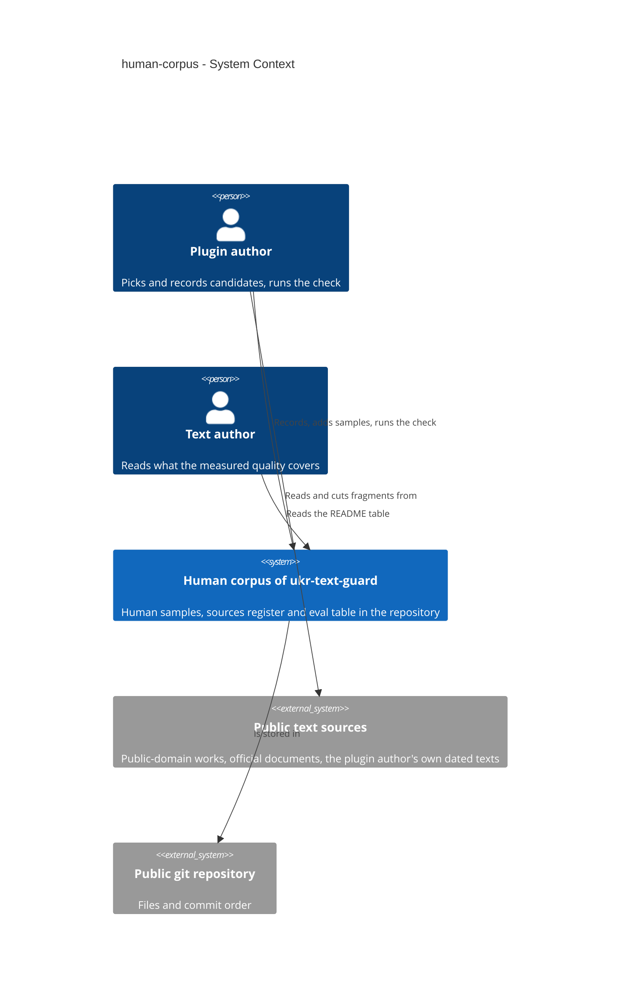
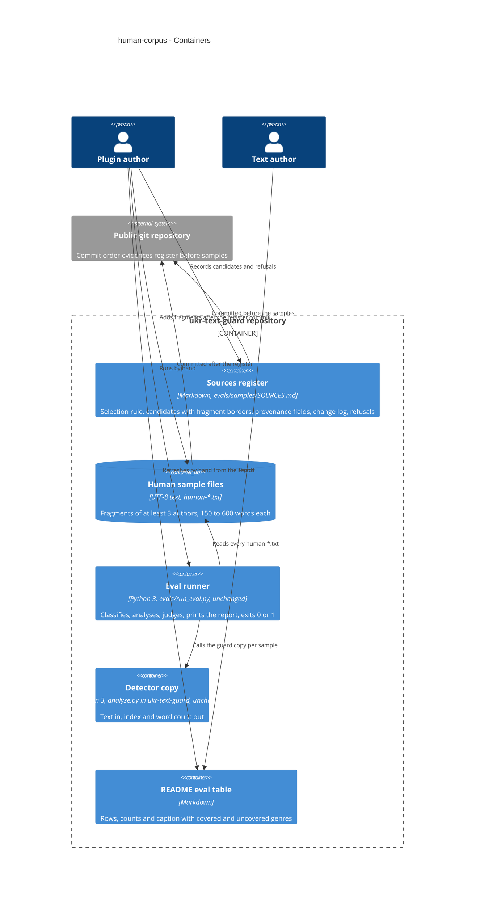
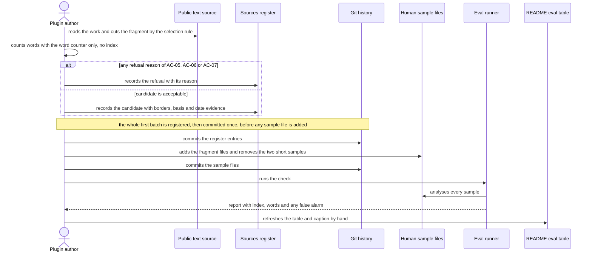
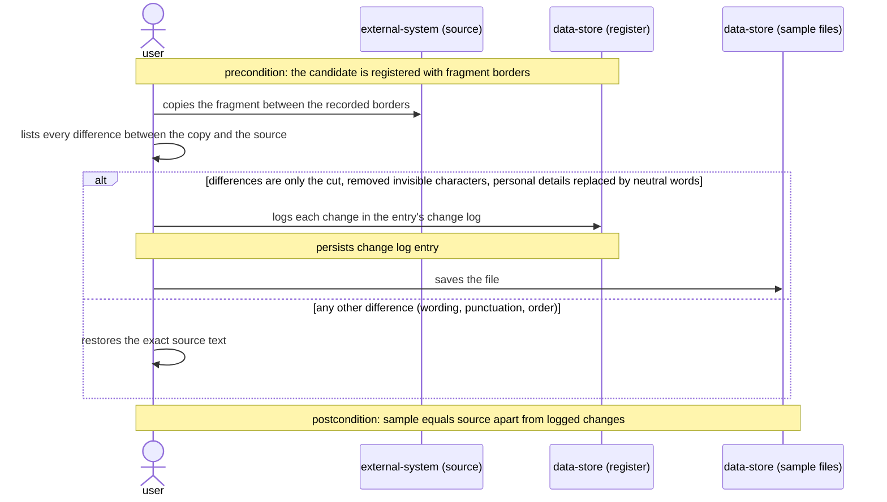
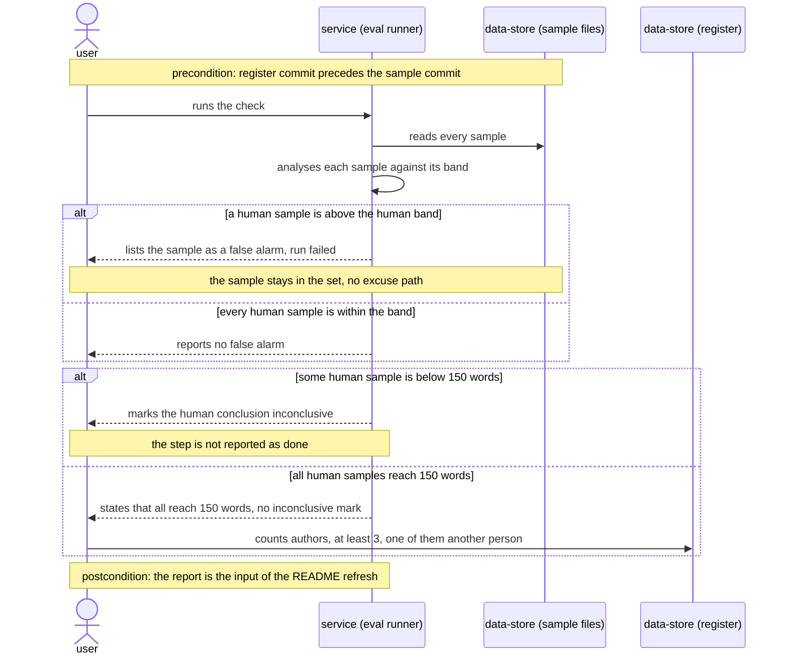
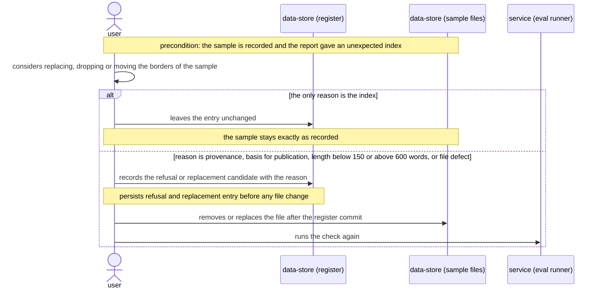
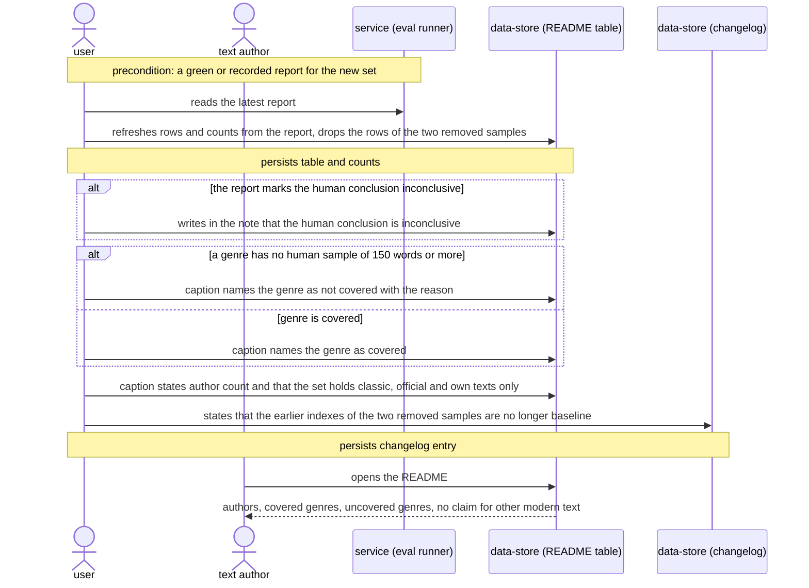

# Software Architecture Document — human-corpus

## 1. Introduction and goals

**Intent.** Grow the human side of the detector's eval from two short samples (both below the 150 words at which the analyzer rates its statistics as reliable, probably by one author) to human texts from at least three authors, one of them another person, every sample at 150 words or more. Each sample is traceable to its author, source, basis for publication and date of writing through a sources register that is written before the analyzer first sees the text. The README states which genres the measured quality covers and which it does not. The step adds data and one register file only: no detector, eval or threshold change.

**Top-3 quality goals (1-liners; full scenarios in §10):**

1. Evidence integrity: the choice of texts cannot follow the scores, and a false alarm stays visible.
2. Provenance and lawful publication: every human sample has a complete register entry and a nameable basis for publication.
3. Reproducible, cheap run: the same files give the same verdict twice, and a full run stays within 60 s.

**Stakeholders.**

| Role | Interest | Sign-off owner? |
|---|---|---|
| Plugin author | Picks and records candidates, runs the check, refreshes the README table | No |
| Text author | Reads the README to see what the measured quality covers | No |
| Tech Lead | SAD approval | Yes |
| Security Lead | Privacy and publication-basis read-through of each own text (spec §6.1, AC-05) | Yes |

<!-- Decision overrides (¶4) — populated by the critic resolution loop, empty otherwise. -->

## 2. Constraints

**Technical.**
- Python 3, standard library only; this step adds no executable code (spec §6.1).
- The eval classifies only `*.txt` files by the `human-` / `ai-` name prefix and ignores every other file in the sample folder (`evals/run_eval.py:56-71`). A plain-text file with another prefix fails the run as unclassified.
- Bands and reliability are named constants: human band 25, drift above 15, reliable length 150 words (`evals/run_eval.py:14-18`). The human conclusion is inconclusive while any human sample is shorter than 150 words (`evals/run_eval.py:259-262`).
- Known-gap can never be put on a human sample (`evals/run_eval.py:109-110`), so a human false alarm has no excuse path.
- One eval run measures one detector copy (default `ukr-text-guard`).

**Organisational.**
- One person (the plugin author); roadmap step 3, no hard deadline; size S.

**Conventions.**
- Sample names are kebab case with the category prefix, `<human|ai>-<descriptor>` (`docs/architecture-map.md`, Conventions). This feature narrows the descriptor for human samples to `human-<author>-<work>.txt` so the register key names the author; the narrowing is this feature's own choice, not a map rule.
- Conventional commit prefixes; README and product content are Ukrainian; pipeline documents are English (`artifact_language: en`).

**Regulatory / external.**
- A text enters the public repository only with a nameable basis for publication (public domain, an official document outside copyright, or the plugin author's own text); no personal data or third-party content may remain (spec §6.1, AC-05).

## 3. Context and scope

The detector gives a Ukrainian text an index from 0 to 100, and the eval checks every sample against a band fixed before the run. This feature widens and documents the human samples, so a conclusion such as «humans stay out of the suspicious zone» rests on more than one voice, and so a text author reading the README sees what that conclusion covers.

<!-- brownfield: `docs/architecture-map.md` read (reflects_commit e6a83b1, a few commits behind HEAD 8edc156); `evals/run_eval.py` read directly for the classification and report rules the feature depends on. -->

**External systems (in / out):**

| Actor or system | Type | Interaction |
|---|---|---|
| Plugin author | Person | Picks candidates, applies the selection rule, records them in the register, commits, runs the check, refreshes the README table |
| Text author | Person | Reads the README table and its caption |
| Public text sources | System (external) | Public-domain works, official documents in the version in force before 2023, the plugin author's own dated originals; read by hand, never fetched by code |
| Public git repository | System (external) | Holds the sample files, the register and the commit order that evidences «registered before analysed» |

External services called at run time: none (deliberate: the eval stays offline and standard-library only).

**C4 Context (L1):**



## 4. Solution strategy

**Target surface (first decision):** `cli`. The only surface the feature touches is the eval runner, a console program (`bash evals/run.sh`, exit code 0 or 1); the feature adds data it reads and introduces no new service, UI or library. A single surface, so the multi-surface gate does not fire.

**Top strategic choices (the seeds for ADRs):**

1. **Register first, samples second** — the whole first batch of candidates, with their fragment borders, is committed to the register in one commit before the analyzer is run on any of them and before any sample file is committed; the eval analyses the whole folder, so a file in the folder is scored at once, and the commit order is the evidence that the choice did not follow the score. A later addition repeats the pattern: its register entry first, its file second. Seed of ADR-0002 (quality goal 1, AC-01, AC-06).
2. **The register is a markdown file beside the samples** — `evals/samples/SOURCES.md`, a non-`.txt` file the eval ignores, human-readable on review. Seed of ADR-0001 (quality goal 2, AC-02, spec §6 register completeness).
3. **Mechanical selection, blind measurement** — the fragment runs from the start of the work or section to the first paragraph end after 150 words; length is measured with the analyzer's own `words()` function without calling `analyze()`, so the index is never seen before registration; the only allowed text changes are the fragment cut, removed invisible characters and neutral replacement of personal details, each logged (AC-06, AC-08). Inline: a convention-level decision on existing code.
4. **Data only, false alarms stay red** — detector, eval and bands are untouched (spec §3); a human sample above 25 fails the run and stays in the set and in the README table. Inline: restates spec non-goals.

Each tactical decision in later sections traces to one of these seeds.

## 5. Building block view

The feature is data plus a documented process, not a layered program: one new file (the register), several new text files, and a refreshed README block, all read by an unchanged eval runner. There is no module to add and no code layering to choose.

**Internal decomposition:**

```
evals/
├── run_eval.py          unchanged: classifies, analyses, judges, reports
├── known-gaps.txt       unchanged: AI samples only
└── samples/
    ├── SOURCES.md       new: selection rule, one section per candidate, refusals section
    ├── human-<author>-<work>.txt   new: at least 3 authors, 150 to 600 words each
    ├── human-business-letter.txt   removed: 16 words, below 150 (spec US-06, AC-09)
    ├── human-story.txt             removed: 24 words, below 150 (spec US-06, AC-09)
    └── ai-*.txt         unchanged
README.md                eval table and caption refreshed by hand from the report; rows of the two removed samples dropped
changelog (at ship)      states that the earlier indexes of the two removed samples are no longer part of the baseline
docs/features/human-corpus/   spec, SAD, ADRs; changelog at ship
```

**C4 Container (L2):**



## 6. Runtime view

**Critical flow 1: add one human sample**



The flow shows one source for readability: the first batch repeats the first block for every candidate, and only then moves on to the register commit. The refusal reasons are the spec's: a candidate that is another person's modern text, a modern edition with editorial rights, or an own text that still holds third-party data (AC-05); a fragment below 150 or above 600 words under the selection rule (AC-06); a date of writing that is unknown or 2023 or later (AC-07). The removal of the two short samples is justified by their length below 150 words, never by their indexes (AC-06, AC-09).

**Critical flow 2: false alarm** — the same flow after the report: a human sample above the band fails the run (exit 1) and stays in the set and in the README table; nothing in the flow changes the sample. Per-AC flow coverage (AC-04, AC-06, AC-09, AC-12) is the `sequences` stage's job.

The flows below use the generic vocabulary: `user` is the plugin author, `service` is the eval runner, `data-store` entries name the file they stand for, `external-system` is a public text source. Flow 1 above keeps its original participant names.

### Flow A: prepare the sample file from the source



### Flow B: run the check and read the verdict



### Flow C: reconsider a recorded sample after an unexpected index



### Flow D: refresh the README and the changelog, then read them



**Coverage of user stories and acceptance criteria**

| Item | Shown by |
|---|---|
| US-01 | Flow 1 (register before files), Flow C |
| US-02 | Flow 1, Flow A |
| US-03 | Flow B, Flow 1 (removal of short samples) |
| US-04 | Flow B |
| US-05 | Flow 1 (refusal branch) |
| US-06 | Flow 1, Flow D |
| US-07 | Flow D |
| US-08 | Flow D |
| AC-01, AC-02 | Flow 1 |
| AC-03, AC-04, AC-12 | Flow B (AC-12 README note: Flow D) |
| AC-05, AC-07 | Flow 1 (refusal branch) |
| AC-06 | Flow 1 (length) and Flow C (index is never a reason) |
| AC-08 | Flow A |
| AC-09 | Flow 1 (removal) and Flow D (README rows, changelog) |
| AC-10, AC-11 | Flow D |

No story or criterion is uncovered and none is a non-runtime N/A.

**Flags for `design`:**

- Flow 1 and the prose stub of flow 2 predate the generic vocabulary and use named participants (plugin author, register, eval runner); Flows A–D use the generic ones. The stub «Critical flow 2» is now drawn as Flow B. Reconcile the naming if wanted; nothing was rewritten here.
- Every persist note writes a text file or a document (register entry, change log, sample file, README table, changelog). No new table, column or index is implied, so `data-model` has nothing to design.
- No ADR-worthy decision beyond ADR-0001 and ADR-0002 surfaced.

## 7. Deployment view

<!-- N/A: no deployment unit; the feature is text files in the repository, and the eval runs by hand on the plugin author's machine. -->

## 8. Crosscutting concepts

| Concept | Convention | Where defined |
|---|---|---|
| Logging | N/A: the eval prints a report, nothing is logged | — |
| Authentication | None; no new permission check (spec §6.1) | spec §6.1 |
| Error handling | The eval report and exit code are the only signal; a false alarm fails the run and has no excuse path | `evals/run_eval.py`, spec AC-04 |
| ID strategy | The sample name stem `human-<author>-<work>` is the key; the register section carries the same stem | here |
| File encoding | UTF-8 without BOM, LF line ends, no invisible characters, so the eval raises no «hidden characters» note | here |
| Internationalisation | Samples and README note in Ukrainian; the register in English | here, `artifact_language` |
| Reproducibility | Two runs on the same files give the same index and verdict; the existing repeat-run check covers it | spec §6 |
| Provenance | Author, genre (one of the four glossary genres), source, basis, date with evidence reference, fragment borders and blind word count, change log | here, ADR-0001 |
| Events | N/A | — |

## 9. Architecture decisions

| # | Title | Status | Section |
|---|---|---|---|
| 0001 | Keep the sources register as a markdown file beside the samples | Accepted | §4 |
| 0002 | Commit each candidate to the register before its sample file | Accepted | §4 |

ADR files live under `docs/features/human-corpus/adr/NNNN-<title>.md`.

## 10. Quality requirements

**QG-1. Evidence integrity**
- **When:** the plugin author sees an unexpected index and considers replacing a text, dropping it or moving its fragment borders.
- **Then:** the sample stays exactly as recorded; a refusal or replacement is accepted only for provenance, basis for publication, a length below 150 words or above 600 words under the selection rule, or a defect of the file; replacements or removals justified by an index stay at 0 (the KPI of spec §7).
- **How verify:** the batch register commit precedes every commit that adds a human sample file in `git log`, and a later addition's register entry precedes its file; the review checklist before shipping records this.

**QG-2. Provenance and lawful publication**
- **When:** a human sample is added or a candidate is refused.
- **Then:** 100% of human samples have every register field filled (author, genre, source, basis for publication, date of writing with evidence reference, fragment borders, change log) and every refused candidate has its reason; each human sample is 150 to 600 words by the analyzer's own count; human sample files total ≤ 150 KB (spec §6).
- **How verify:** review checklist before shipping; words column of the report; summed size of the human sample files at review.

**QG-3. Reproducible, cheap run**
- **When:** the plugin author runs the check on up to 30 samples.
- **Then:** two runs on the same files give the same index and verdict for every sample, and a full run takes ≤ 60 s (spec §6).
- **How verify:** the existing repeat-run check of the eval; the duration line of the report.

## 11. Risks and technical debt

| Risk / debt | Severity | Mitigation | Owner |
|---|---|---|---|
| A formal or legal official text scores above 25; the detector is frozen and known-gap cannot be put on a human sample, so the run stays red with no way out | Medium | Keep the sample, record the false alarm as a known limitation in the README caption; tuning is a separate job outside this step (spec §3) | Ihor Furman |
| No free source of modern business mail, blogs or informal fiction with a proven pre-AI date; the human set covers classic, official and own texts only | Medium | The README caption names each uncovered genre with the reason (AC-10, AC-11); never present the result as proof for modern text | Ihor Furman |
| «Registered before analysed» is evidenced by commit order, not enforced by code; history rewriting or a local analyzer run on a candidate cannot be detected | Medium | Candidates are measured with the word counter only; register commit is pushed before the sample commit; the review checklist compares `git log` order | Ihor Furman |
| Evidence of the date of writing for an own text is weak (spec §8 OQ-1) | Medium | Default: any dated original the plugin author can point to, recorded as a reference; a text without it is refused (AC-07); resolve before the first run | Ihor Furman (due: before the first run) |
| An edition of a classic or a version of an official document carries editorial rights (spec §8 OQ-2) | Medium | Default: the original public-domain text and the law version in force before 2023; resolve before the first run | Ihor Furman (due: before the first run) |
| Old orthography or archaic vocabulary of a classic may move the index regardless of authorship | Low | If observed, record as a known limitation; the text is never swapped for its index (AC-06) | Ihor Furman |
| Fragments of 150 to 600 words give noisy evidence | Low | The README says the set makes the evidence less noisy, not statistically significant (spec §3) | Ihor Furman |
| The eval does not check the register (spec §8 OQ-3) | Low | Review checklist before shipping; revisit whether the eval should check it after this step ships (see ADR-0001 for the cost of a later check) | Ihor Furman (due: after this step ships) |

**Accepted debt (acceptable now, plan to fix later):**
- The register is checked by hand against a checklist, not by code.
- The eval still measures one detector copy and does not prove the three copies identical.

## 12. Glossary

| Term | Meaning |
|---|---|
| Another person | An author who is neither the plugin author nor an official body |
| Author | One named person, or for an official document the one body that adopted it; not the number of files |
| Basis for publication | The reason a text may sit in the public repository: public domain, an official document outside copyright, or the plugin author's own text |
| Candidate | A text recorded in the register before the analyzer first ran on it; not yet a sample |
| Covered genre | One of the four genres with at least one human sample of 150 words or more in the register |
| Selection rule | The fixed rule that gives fragment borders: from the start of the work or section to the first paragraph end after 150 words |
| Sources register | `evals/samples/SOURCES.md`: every candidate with its provenance fields and every refusal with its reason; not the eval table |
| False alarm | A human sample with an index above the human band of 25; not a miss |
| Inconclusive | The mark on the human conclusion when fewer than all human samples reach 150 words; not a failed run |
| Known-gap | A flag on an AI sample the detector is known to miss; never allowed on a human sample |
