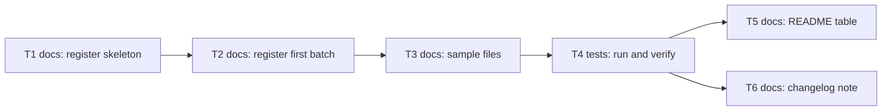

# Epic — human-corpus

> **Spec:** [spec.md](../spec.md) · **Design:** [sad.md](../sad.md) · **ADRs:** [adr/](../adr/) (no data model and no API contract: text files and one register only)

## Goal

Grow the human side of the eval from two short samples to human texts from at least three authors, one of them another person, every sample at 150 words or more, each traceable through a sources register written before the analyzer sees the text. The README then states which genres the measured quality covers and which it does not (spec §2).

## Scope

- **In:** `evals/samples/SOURCES.md`, new `human-*.txt` files, removal of `human-business-letter.txt` and `human-story.txt`, the README eval table and caption, a changelog note, one saved eval report.
- **Out:** detector rules or thresholds, any eval change or register check in the eval, modern business mail, blogs and informal fiction, AI or bypass samples, hook thresholds, table automation (spec §3).

## Task map

T1, T2 and T3 edit `evals/samples/SOURCES.md` in turn, so they run in one lane in that order; T5 and T6 touch different files and run in parallel after T4.

## Tasks

See [tracker.md](./tracker.md) for status. Machine contract: [tasks.json](../tasks.json).

| # | Task | Layer | Blocked by | DoD (short) |
|---|---|---|---|---|
| T1 | [Create the sources register skeleton](./create-sources-register.md) | docs | — | The register file exists with a complete entry template, and the eval reports no new unclassified item. |
| T2 | [Select candidates and register the first batch](./register-first-batch.md) | docs | T1 | The register commit lists at least three authors with complete fields and every refusal reason, with no sample file in that commit. |
| T3 | [Add the sample files and remove the two short ones](./add-sample-files.md) | docs | T2 | Every human sample file matches its registered fragment apart from logged changes, the two short files are deleted, and the register commit precedes this one. |
| T4 | [Run the check and verify the verdict](./run-check-and-verify.md) | tests | T3 | The saved report shows every human sample at 150 words or more with at least three authors in the register, or records the false alarm or the inconclusive mark as observed. |
| T5 | [Refresh the README table and caption](./refresh-readme-table.md) | docs | T4 | Every README row and count matches the saved report and the caption names covered and uncovered genres with reasons and the author count. |
| T6 | [Write the changelog note on the removed baseline](./write-changelog-note.md) | docs | T4 | The changelog states that the earlier indexes of the two removed samples are no longer part of the baseline and its figures equal the saved report. |

## Risks / Hard rules

- The register commit precedes every commit that adds a human sample file (ADR-0002, spec §6.1).
- A score is never a reason to change, drop or replace a sample (AC-06); a false alarm stays and stays visible.
- No personal data or third-party content in a sample; no text without a nameable basis for publication (AC-05).
- Detector, eval and bands are not touched (spec §3).
