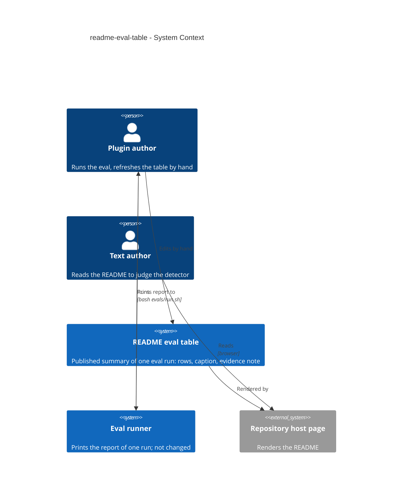
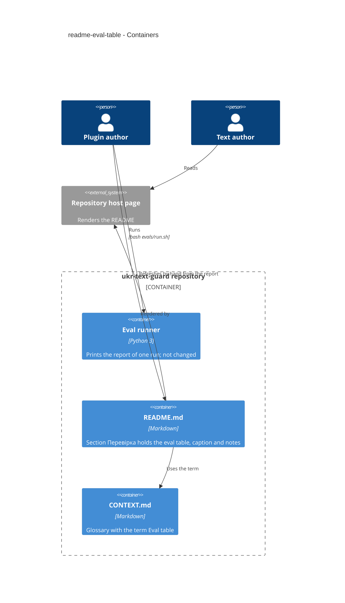
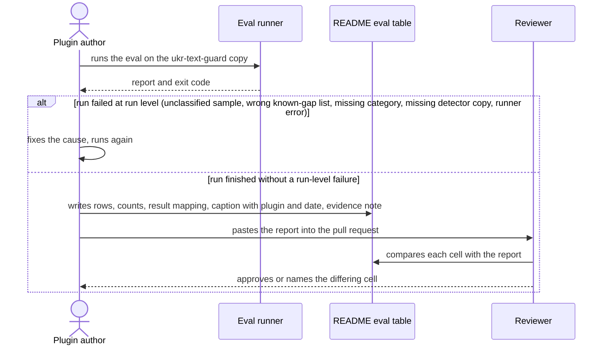

# Software Architecture Document — readme-eval-table

## 1. Introduction and goals

**Intent.** Replace the README sample table with an eval table: one row per sample with its category, expected band, known-gap status, the index of the last run and the result of the row, a caption that names the plugin copy and the run date, and a note on how far the human evidence reaches. A text author then sees what the detector is expected to do and what it did, without running anything. The plugin author refreshes the table by hand from one eval report (spec §1).

**Top-3 quality goals (1-liners; full scenarios in §10):**

1. **Accuracy** — every cell of category, known-gap status, index and result equals the report of the run named in the caption (spec §6 Accuracy).
2. **Honest evidence** — failed samples are shown as failed, short human evidence is stated as inconclusive, the index is never presented as proof (spec §2, AC-05, AC-06, AC-07).
3. **Completeness and rendering** — every sample of the report is a row, and the table is one plain markdown table of 6 columns with 0 HTML (spec §6 Completeness, Rendering).

**Stakeholders.**

| Role | Interest | Sign-off owner? |
|---|---|---|
| Plugin author | Runs the eval, refreshes the table by hand, keeps the known-gap list | No |
| Text author | Reads the README table to judge how the detector behaves | No |
| Reviewer | Compares each table cell with the pasted report before merge | No |
| Tech Lead | SAD approval | Yes |

<!-- Decision overrides (¶4): none. -->

## 2. Constraints

**Technical.**
- The change is a documentation edit: the README table area and one glossary entry. 0 code files (spec §6 Footprint).
- The source of the cells category, known-gap status, index and result is the report printed by `evals/run_eval.py` (Python 3, standard library only); the expected band is the band the eval defines (spec AC-02), and the date in the caption is the day the plugin author ran the eval, which the report does not print (spec AC-10). The runner, the bands and the sample set are not changed (spec §3).
- Plain markdown only, 0 HTML; the table must render on the repository host page (spec §6 Rendering).

**Organisational.**
- Sized XS: one PR, at most one day, one maintainer.
- Roadmap step 2; it waits for nothing and runs in parallel with steps 3 and 4, which is why the spec drops the rule to refresh the table in their changes.

**Conventions.**
- `docs/architecture-map.md`: product content and the README are Ukrainian; conventional commit prefixes (`docs:` here).
- The table headers, cell values, caption and notes are Ukrainian (spec §6 Language); the pipeline documents are English (`artifact_language: en`).

**Regulatory / external.**
- Data classification is public: the README is shown on a public repository. The table shows sample names and indexes only, never the sample texts (spec §6.1).
- No authorization boundary; security review N/A (spec §6.1).

## 3. Context and scope

The README already has a table of the 10 samples with the index each got, but no expected band and no mark for the sample the detector is known to miss. The eval step shipped on 2026-10-03 judges every sample against a band and tracks known gaps, but its facts live only in the plugin author's terminal output. This feature publishes one run's result in the README.

<!-- brownfield: scanned from docs/architecture-map.md (reflects e6a83b1; the only later changes are docs, so the map still describes the code) — evals/run_eval.py prints the report, README section «Перевірка» holds the old table -->

**External systems (in / out):**

| Actor or system | Type | Interaction |
|---|---|---|
| Plugin author | Person | Runs the eval by hand, copies the results into the table, pastes the report into the pull request |
| Text author | Person | Reads the rendered README |
| Reviewer | Person | Compares each table cell with the report pasted into the pull request (a role of the plugin author's review, not a separate system) |
| Eval runner (`evals/run_eval.py`) | System (internal, not changed) | Prints the report that is the source of the category, known-gap, index and result cells |
| Repository host page | System (external) | Renders the README markdown |

**C4 Context (L1):**



## 4. Solution strategy

**Top strategic choices (the seeds for ADRs):**

1. **Target surface: `cli`.** The feature has no surface of its own; its only source is the output of the eval runner, which is a command-line tool, and its product is a documentation table. `cli` is the nearest declared surface, so downstream stages read a value; no UI task layer applies (decided here at depth easy, no question asked; no ADR, it is not irreversible).
2. **The table is maintained by hand from one report** — ADR-0001. A generated table and a drift check are different features (spec §3, §8), so one hand-made edit now keeps the runner untouched and the footprint at 2 files.
3. **The row result is derived from the report by a fixed mapping** — the report's row verdict plus the section that lists the sample give one of six Ukrainian values (spec AC-08). The mapping is a rule of the refresh, not code.
4. **Honesty is part of the layout, not of the prose around it** — a failed row is shown as failed with its reason, the human-evidence note carries the count of long human samples, and the text beside the table points to the existing section «Чесна межа» (spec AC-05, AC-06, AC-07).

Each tactical decision in later sections traces to one of these seeds.

## 5. Building block view

The change touches two documents and no code: a hand-edited table in the README and one glossary term. There are no layers, only the report (source) and the table (published copy).

**Internal decomposition:**

```
README.md                  section «Перевірка»: intro line, eval table, caption, notes (old table replaced)
CONTEXT.md                 term «Eval table» (added in commit 8f3d89e)
evals/run_eval.py          unchanged; prints the report that feeds the table
```

**C4 Container (L2):**



## 6. Runtime view

**Critical flow 1: refresh the table from one run**



A failed row (false alarm, miss, analyzer failure) is a legal input of this flow: it is written as failed with its reason, never softened (spec AC-07, AC-09). Only a run-level failure blocks the refresh (spec AC-09b).

## 7. Deployment view

<!-- N/A: documentation only, reuses the repository and the host's README rendering with no infra change -->

## 8. Crosscutting concepts

| Concept | Convention | Where defined |
|---|---|---|
| Language | Table headers, cell values, caption and notes in Ukrainian; categories «людський» and «ШІ» | spec §6 Language, AC-08 |
| Result mapping | Six fixed values from the row verdict plus the report section; analyzer failure beats a known-gap flag; a drift warning leaves «пройдено» | spec AC-08 |
| Known-gap authority | Only the plugin author's flag in `evals/known-gaps.txt` excuses a sample; a human sample is never known-gap | spec AC-09 |
| Evidence limit | A note states how many human samples reach 150 words out of how many | spec AC-05, AC-05b |
| Run identity | The caption names the plugin copy and the calendar date of the run | spec AC-10 |
| Logging, auth, IDs, events | N/A, no code and no accounts | — |

## 9. Architecture decisions

| # | Title | Status | Section |
|---|---|---|---|
| 0001 | Maintain the eval table by hand from one report | Accepted | §4 |

ADR files live under `docs/features/readme-eval-table/adr/NNNN-<title>.md`.

## 10. Quality requirements

**QG-1. Accuracy**
- **When:** the plugin author refreshes the table from one run.
- **Then:** 100% of table cells (category, known-gap status, index, result) equal the report of the run named in the caption.
- **How verify:** the plugin author pastes the report into the pull request description and the reviewer compares the table with it before merge (spec §6 Accuracy).

**QG-2. Honest evidence**
- **When:** a sample fails, or fewer than all human samples reach 150 words.
- **Then:** the failed row says failed with its reason, the note states the count of human samples that reach 150 words and calls the human result inconclusive, and the text around the table points to «Чесна межа».
- **How verify:** read the rendered README against AC-05, AC-06 and AC-07 in review.

**QG-3. Completeness and rendering**
- **When:** the table is merged.
- **Then:** 100% of the human and AI samples the report lists are rows, per-category counts equal the report's summary, and the table is 1 table of 6 columns with 0 HTML shown as a table on the repository host page.
- **How verify:** compare counts before merge and open the rendered README (spec §6 Completeness, Rendering).

## 11. Risks and technical debt

| Risk / debt | Severity | Mitigation | Owner |
|---|---|---|---|
| The table goes stale when samples, the known-gap list, bands or a detector copy change, and no drift check exists | Medium | The caption names the plugin copy and the run date so staleness is visible; the plugin author refreshes it in the same change as a habit; spec §8 tracks a generated table and a drift check | Plugin author |
| A hand-typed cell differs from the report | Medium | The reviewer compares every cell with the pasted report before merge (QG-1) | Reviewer |
| The human conclusion rests on 2 short samples (67 and 101 words), so a clean human result may be read as proof | Medium | The evidence note states the count and «inconclusive» (AC-05); roadmap step 3 grows the human set | Plugin author |
| `target_surfaces: [cli]` is the nearest value, not a real surface of this feature | Low | Named in §4; no downstream UI or contract work follows from it | Plugin author |

**Accepted debt (acceptable in v1, plan to fix later):**
- The table is hand-made and carries no automatic check against the report; spec §8 keeps this open.
- The table covers only the ukr-text-guard copy, not the other two plugin copies; proving the copies identical belongs to roadmap step 4.

## 12. Glossary

| Term | Meaning |
|---|---|
| Eval table | The table in the project README that lists every sample with its category, expected band, known-gap status, the index of the last run and the result of the row, with a caption naming the plugin copy and the run date and a note on how far the human evidence reaches; the plugin author refreshes it by hand from the report. NOT the eval report: only a published summary of one run |
| Eval report | What one eval run prints and its exit code reports; the source of the category, known-gap, index and result cells of the table |
| Known-gap | A flag the plugin author puts on an AI sample that the detector is known to miss; the sample is tracked and never fails a run. NOT a category of its own and NOT a failing check; it can never be put on a human sample |
| Result of the row | One of six values derived from the report: passed, failed (false alarm, miss or analyzer failure), known-gap, gap may be closed |
| Evidence note | The note beside the table that states how many human samples reach 150 words, the point under which the analyzer marks its statistics as low |
