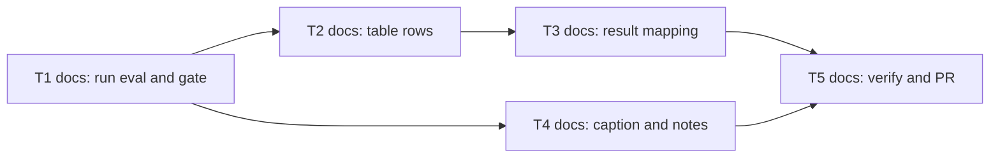

# Epic — readme-eval-table

> **Spec:** [spec.md](../spec.md) · **Design:** [sad.md](../sad.md) · **ADRs:** [adr/](../adr/) (no data model and no API contract: documentation only)

## Goal

Replace the README sample table with an eval table that shows, per sample, the expected band, the known-gap status, the index of the last run and the result of the row, with a caption naming the plugin copy and the run date and a note on how far the human evidence reaches. A text author then sees what the detector is expected to do and what it did, and is not misled by short evidence or by a softened failure (spec §2).

## Scope

- **In:** the table area of the README section «Перевірка» (table, caption, notes), the glossary term «Eval table» in `CONTEXT.md` (added in commit 8f3d89e), one eval run as the source.
- **Out:** generating the table or checking drift, any change to the runner, detector, bands or sample set, the other two plugin copies, extra columns, restructuring the README (spec §3).

## Task map

T2, T3 and T4 edit the same file (`README.md`), so they run in one lane, in the order T2, T3, T4. The graph below shows the real dependencies.

## Tasks

See [tracker.md](./tracker.md) for status. Machine contract: [tasks.json](../tasks.json).

| # | Task | Layer | Blocked by | DoD (short) |
|---|---|---|---|---|
| T1 | [Run the eval on the ukr-text-guard copy and gate on run-level failure](./run-eval-and-gate.md) | docs | — | A report without a run-level failure is kept with the run date; no repo file changed |
| T2 | [Replace the README sample table with the eval table header and rows](./write-table-rows.md) | docs | T1 | One 6-column table, rows and counts equal the report, bands 25 or below and 26 or above |
| T3 | [Fill the result cells with the six-value mapping, known-gap and failed rows](./apply-result-mapping.md) | docs | T2 | Every result is one of six values matching the report; only flagged samples are known-gap |
| T4 | [Add the caption, the evidence note and the pointer to the honest-limit section](./add-caption-and-notes.md) | docs | T1 | Caption names plugin and date; note states N of M human samples at 150 words; link to the honest limit |
| T5 | [Compare the table with the report and prepare the pull request](./verify-against-report.md) | docs | T3, T4 | Zero differences against the report; diff is README and CONTEXT only |

## Risks / Hard rules

- Accuracy: 100% of cells (category, known-gap status, index, result) equal the report of the run named in the caption (spec §6).
- A failed row is shown as failed with its reason, never softened; only the plugin author's flag in `evals/known-gaps.txt` excuses a sample, and never a human one (spec AC-07, AC-09).
- Only a run-level failure blocks the refresh; a failed row does not (spec AC-09b, sad §6).
- Rendering and language: 1 table, 6 columns, 0 HTML, Ukrainian wording; footprint 2 files outside docs, 0 code files (spec §6).
- The hand-made table has no drift check; the caption's plugin and date are the staleness signal (sad §11, ADR-0001).
