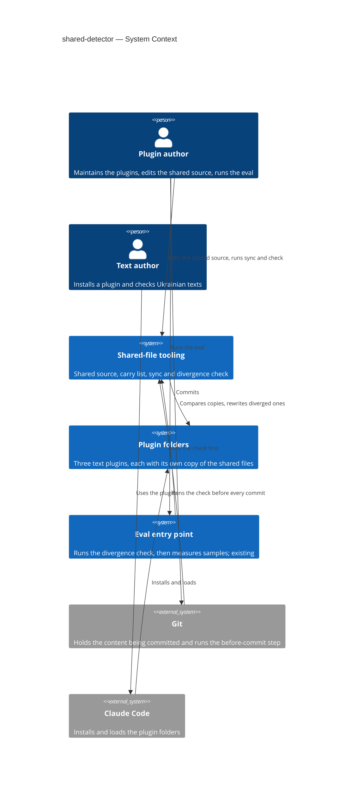
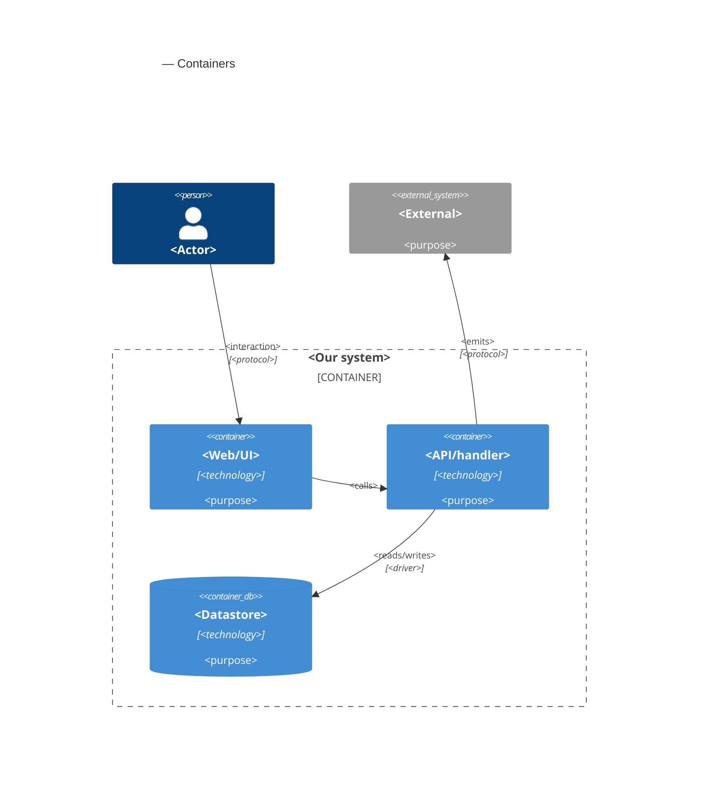

# Software Architecture Document — shared-detector

<!-- 12 Arc42 sections. Empty section → <!-- N/A: <one-line reason> -->. -->
<!-- C4 Context (L1) lives inline in §3. C4 Container (L2) lives inline in §5. -->
<!-- Numbers in §10 come VERBATIM from spec.md §6 NFR — no inventing, no rounding. -->

## 1. Introduction and goals

**Intent.** The plugin author edits each shared file in one place (a shared source) and brings every plugin copy up to date in one run, with the run listing what it rewrote. Any divergence between a plugin copy and the shared source is reported, with the file and the plugin named, before the copies can be committed or measured by the eval. A text author who installs any of the three text plugins gets the same files on the same paths and the same detector results as before the step.

**Top-3 quality goals (1-liners; full scenarios in §10):**

1. **Completeness of detection** — every one of the 4 divergence kinds (differing, missing, unlisted, differing only in line endings) is caught and reported with the file and the plugin named.
2. **Safety of writes** — the sync is idempotent, writes byte for byte, writes only to plugin copies named in the carry list, and never deletes a file.
3. **Unchanged behaviour and portability** — the eval runner, its unit tests and every installed plugin behave as before; each command takes ≤ 2 s; only the standard library, on each interpreter the eval entry point already probes.

**Stakeholders.**

| Role | Interest | Sign-off owner? |
|---|---|---|
| Plugin author | Edits the shared source, runs the sync and the divergence check, commits | No |
| Text author | Installs a plugin and expects it to work as before; does not run the tooling | No |
| Tech Lead | SAD approval | Yes |

## 2. Constraints

**Technical.**
- Python 3, standard library only, with no import outside it. The code is written to run on Python 3.8 or newer: the repository pins no minimum, the local interpreter is 3.12.10, and no module newer than 3.8 is used (no `tomllib`, no `match`). The interpreters are the three that `evals/run.sh` already probes, in this order: `python3`, `python`, `py`.
- Bash for `evals/run.sh` and the before-commit step (Git Bash on Windows); Git 2.9 or newer, because the before-commit step is activated through `core.hooksPath`.
- Layout convention of the repository: a plugin is `plugins/<name>/skills/<name>/`; the skill folder carries the shared files at fixed paths inside it (`scripts/`, `references/`).
- No datastore: the only state is files in the repository.

**Organisational.**
- Size S: about 2 to 5 PRs, about one week.
- No deadline is set in the spec.
- One maintainer, who is also the reviewer: Ihor Furman, the plugin author.

**Conventions.**
- Commit prefixes `feat:`, `chore:`, `test:`, `docs:`; code, tests, test names and commit messages in English; the README and product texts in Ukrainian.
- Tests are `unittest` tests run with `python -m unittest discover <dir>`; the 74 existing tests in `evals/tests/` and the eval runner `evals/run_eval.py` are not changed.
- Machine lines of the output follow the eval runner: `error <code>: <message>` and a final `result: <passed|failed>` line, in English.

**Regulatory / external.**
- None. Every file involved is committed to a public repository and holds no personal data (spec §6.1).

## 3. Context and scope

The marketplace ships three text plugins that each carry their own physical copy of the same shared files, because an installed plugin is a copy of its own folder. This feature adds the tooling that keeps those copies equal to one shared source: a sync that rewrites them, and a divergence check that fails when they differ. It sits between the plugin author and the plugin folders; the text author only sees its result, as unchanged plugins.

<!-- brownfield: architecture-map.md (reflects_commit e6a83b1, plugins unchanged since): 4 plugins under plugins/, one skill each, no shared source, no CI, evals/run.sh as the only entry point of the eval -->

**External systems (in / out):**

| Actor or system | Type | Interaction |
|---|---|---|
| Plugin author | Person | Edits the shared source, runs the sync and the divergence check, runs the eval, commits |
| Text author | Person | Installs a plugin through Claude Code; never touches the tooling |
| Git | System (external) | Runs the before-commit step; holds the content being committed |
| Claude Code | System (external) | Installs and loads the plugin folders from the marketplace |
| Eval entry point | System (internal, existing) | Runs the divergence check first, then the eval runner, which is unchanged |
| Plugin folders | System (internal, existing) | Hold the plugin copies; the only place the sync writes |

**C4 Context (L1):**



## 4. Solution strategy

**Target surface.** `cli` (`target_surfaces: [cli]` in the frontmatter): a console application with two commands, `check` and `sync`, flags and exit codes. The before-commit hook and `evals/run.sh` are thin callers of that one command, not surfaces. One surface, so there is no multi-surface ADR and no UI-architecture decision.

**Top strategic choices (the seeds for ADRs):**

1. **One plan, two commands.** The core builds a plan from three inputs: the shared source, the carry list and a tree of plugin copies. `check` renders the plan and never writes. `sync` validates the carry list first, then applies the plan, then renders it. Both use the same comparator, so the sync can never write something the check would still call a divergence, or call «up to date» something the check would fail. Serves quality goals 1 and 2.
2. **Exact bytes.** Content is compared and written as bytes, with no normalisation of line endings or invisible marks (spec AC-12), and the sync never deletes a file, so an unlisted file is reported and left for the author (spec §8, first question). Serves quality goal 2.
3. **Three entry points, one exit-code contract.** The on-demand command, `evals/run.sh` and the before-commit hook all call the same command and read the same codes: 0 equal, 3 divergence or wrong carry list, 4 the check could not run. A check that could not run is never read as a pass. The eval entry point stops before any sample on any non-zero code and ends with 3 or 4, never with the exit code 0 or 1 that the runner uses. Serves quality goals 1 and 3.
4. **The before-commit step judges the staged content, not the working folder.** The core reads content through a tree reader with two implementations, the working folder and the Git index → [ADR-0001](adr/0001-read-staged-content-from-the-git-index.md). Serves quality goals 1 and 2.
5. **The hook ships in the repository and is switched on once per clone.** A committed `.githooks/pre-commit` activated by `git config core.hooksPath .githooks` → [ADR-0002](adr/0002-ship-the-hook-in-githooks-with-core-hookspath.md). Serves quality goal 1 without adding a dependency (goal 3).
6. **The shared source mirrors the in-skill paths, and the carry list is data.** `shared/` holds the five files at the path they have inside a skill folder, and `shared/carry.json` maps each path to the plugins that carry it → [ADR-0003](adr/0003-mirror-in-skill-paths-under-shared-with-a-json-carry-list.md). Serves quality goals 1 and 3 (no file added to any plugin).

Each tactical decision in later sections should trace to one of these seeds. Tactical decisions that *contradict* a strategic choice are red flags — surface them in §11.

## 5. Building block view

<!-- 🎯 Why: INTERNAL DECOMPOSITION — modules, containers, datastores. The static topology: who
     may talk to whom. Without §5, §6 (the flows) has no vocabulary of participants.
     📋 Write: 1 ¶ on the style (layered / hexagonal / clean / event-driven) + a folder tree + a
     C4Container block.
     📌 Draw ONE Container per declared `target_surface` (frontmatter): a fullstack
     [backend-service, web-frontend] = a backend-API container + a web/SPA container; a
     [backend-service, mobile-app] = the API + the mobile app. The Container(web, …) line below is
     just one surface's container — swap/add per what was declared in §4. → _shared/surfaces.md
     📌 e.g. «web app, content API, media worker, datastore, object store, CDN». -->

<One paragraph: layered / hexagonal / clean / event-driven, and why.>

**Internal decomposition:**

```
<e.g. modules/<feature>/>
├── domain/       <entities + sentinel errors>
├── app/          <use cases / services>
├── infra/        <repository + integration impl>
├── ports/        <handlers, DTOs, error mapping>
└── wiring        <self-wiring entry point>
```

**C4 Container (L2):** <!-- syntax → references/c4-mermaid-syntax.md. Real names, no <placeholder> stubs. ONE Container per declared target_surface (frontmatter); the web container below is one example surface. -->



## 6. Runtime view

<!-- 🎯 Why: the RUNTIME FLOW of 1–2 critical scenarios — who talks to whom, when, in what order.
     Without §6, §5 is just boxes with no life.
     📋 Write: a Mermaid sequenceDiagram. Participants are names from §5 (don't invent new ones).
     Messages are semantic («saves a draft»), NO HTTP verbs / paths / status codes — endpoint-level
     sequences arrive at the `api` stage.
     📌 e.g. «author → web: composes draft → web → content API: save». Seed the primary flow(s) here;
     the `sequences` stage then covers every §5 AC (no cap). Never N/A for M+; XS/S keeps ≥1 happy-path flow. -->

**Critical flow 1: <flow name>**

```mermaid
sequenceDiagram
    actor Actor
    participant Web
    participant Service
    participant Store
    Actor->>Web: <action>
    Web->>Service: <call>
    Service->>Store: <write>
    Store-->>Service: ok
    Service-->>Web: result
    Web-->>Actor: confirmation
```

**Critical flow 2: <e.g. async event propagation>** — <if applicable, otherwise N/A>.

## 7. Deployment view

<!-- 🎯 Why: the TOPOLOGY DevOps must know without reading the deploy charts — how many replicas,
     where the background worker lives, AT WHAT NUMBERS we scale.
     📋 Write: 2–3 sentences on topology + monitoring + concrete threshold numbers.
     📌 e.g. «500 authors → partition by quarter» (not «we'll think about scale later»).
     🎯 N/A allowed for XS/S that reuses an existing deployment unit with no change.
     Deployment-diagram scaffold → templates/deployment.md. -->

<Topology in 2–3 sentences. Where it runs, replicas, scaling thresholds.>

**Monitoring:**
- <Metrics — e.g. `<metric_name>`>
- <Alerts — e.g. «worker lag > 10 min → page on-call»>
- <Tracing — e.g. spans on the request boundary>

**Scaling thresholds:**
- <e.g. comfortable in one table up to N rows/year>
- <e.g. partition by quarter above N rows/year>

<!-- For XS/S with no deployment change: <!-- N/A: reuses existing deployment unit, no infra change --> -->

## 8. Crosscutting concepts

<!-- 🎯 Why: CROSS-CUTTING PATTERNS spanning several modules: logging, errors, authorization, ID
     strategy, events, caching. ⭐ The second-densest section. A pattern inside one module is NOT
     here; a project-wide convention belongs in the convention file.
     📋 Write: a table — concept / convention / where defined. One row per concept.
     📌 e.g. «sortable time-based IDs generated in the app layer» as a default from the convention file. -->

| Concept | Convention | Where defined |
|---|---|---|
| Logging | <e.g. structured, fields `module=<name>`> | <convention file §X or here> |
| Authentication | <e.g. token-based via middleware> | <convention file §X> |
| Error handling | <e.g. domain sentinel → ports error mapping → JSON> | <convention file §X> |
| ID strategy | <e.g. sortable time-based ID in the app layer> | <convention file §X> |
| Internationalisation | <e.g. N/A, single language> | — |
| Observability | <e.g. tracing on the request boundary> | — |
| Events | <module-specific patterns, if any> | <here> |

## 9. Architecture decisions

<!-- 🎯 Why: the REVERSE INDEX onto the adr/ folder. `ls adr/` gives the files; §9 gives the
     semantics — why they exist, which SAD section they attach to, what status.
     📋 Write: a 4-column table, one row per ADR. Mixed status is fine.
     📌 e.g. «0001 | Store content as a table of typed blocks | Accepted | §4». -->

| # | Title | Status | Section |
|---|---|---|---|
| <NNNN> | <imperative — e.g. "Use a sliding-window counter for rate limiting"> | Accepted | §<N> |
| <NNNN> | <imperative — e.g. "Co-locate the worker in the API process"> | Accepted | §<N> |

ADR files live under `docs/features/<slug>/adr/NNNN-<title>.md`.

## 10. Quality requirements

<!-- 🎯 Why: the QUALITY TREE — take a goal from §1 and break it into concrete leaves: tests,
     metrics, configs, drills. ⭐ Without §10, §1 is a manifesto. With §10 each declaration maps
     to something PROVABLE.
     📋 Write: per §1 goal — When / Then / How-verify. Numbers from spec §6 NFR VERBATIM (don't
     round ≤250ms to ≤300ms — that's a critic F6 hit).
     📌 e.g. «p95 ≤ 500 ms on a block update, verified by a 100 req/s load test». -->

Each top-3 goal from §1 expanded into a full scenario:

**QG-1. <quality attribute>**
- **When:** <trigger condition>
- **Then:** <expected behaviour with numbers from spec §6 NFR>
- **How verify:** <test / chaos drill / load test / metric>

**QG-2. <quality attribute>**
- **When:** <trigger>
- **Then:** <expected>
- **How verify:** <how>

**QG-3. <quality attribute>**
- **When:** <trigger>
- **Then:** <expected>
- **How verify:** <how>

## 11. Risks and technical debt

<!-- 🎯 Why: ⭐ collects EVERYTHING that can break — not only the technical. Without §11 risks get
     discussed at standups and lost; debt lives only in the head of whoever accepted it.
     📋 Write: a risk/debt table — severity — mitigation — owner. Accepted debt in its own block.
     📌 The first risk is often a product risk, not a technical one. That's normal. -->

<!-- Severity literals: Low / Medium / High for regular risks; "Open question" for rows created by
     a Save-as-OQ resolution during the Socratic walk (see references/socratic.md). -->

| Risk / debt | Severity | Mitigation | Owner |
|---|---|---|---|
| <e.g. Worker lag may reach hours during a downstream outage> | Medium | <alert >10 min, on-call playbook, retry backoff> | <DevOps> |
| <e.g. No event-schema versioning in v1> | Medium | <ADR-NNNN planned for v2, tolerate unknown fields> | <Backend> |
| Open architectural decision: <decision-headline> | Open question | Resolve before <stage trigger or YYYY-MM-DD>; <inline rationale from the Save-as-OQ> | <owner> |

**Accepted debt (acceptable in v1, plan to fix later):**
- <e.g. the entity is immutable / unversioned — OK for v1, may need audit versioning in v2>

## 12. Glossary

<!-- 🎯 Why: ⭐ the DOMAIN GLOSSARY that ends arguments a year later («checkpoint — weekly or
     biweekly? quarter — calendar or fiscal?»).
     📋 Write: a term / meaning table. Business + technical terms mixed.
     📌 e.g. «Lesson | a unit inside a course made of blocks (text, video)». -->

| Term | Meaning |
|---|---|
| <e.g. domain object A> | <its meaning in this domain> |
| <e.g. domain object B> | <its meaning> |
| <e.g. domain invariant name> | <the rule, in plain language> |
