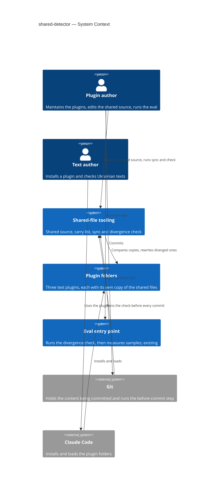
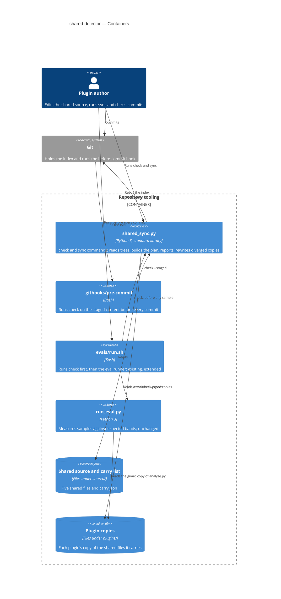
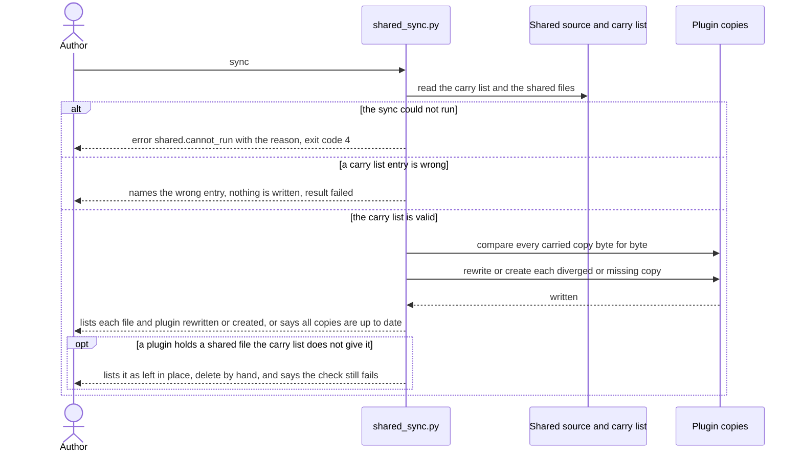
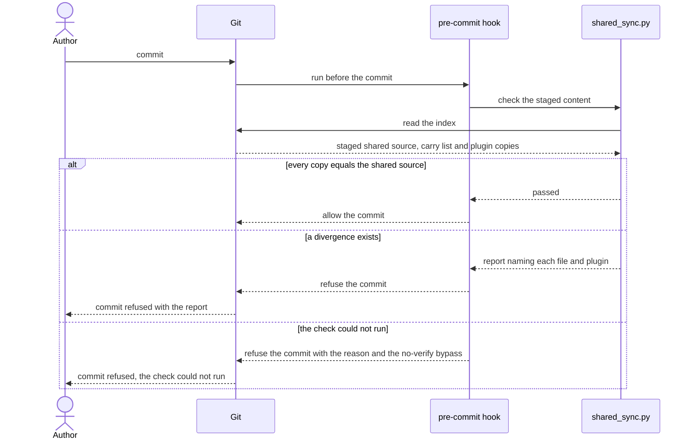
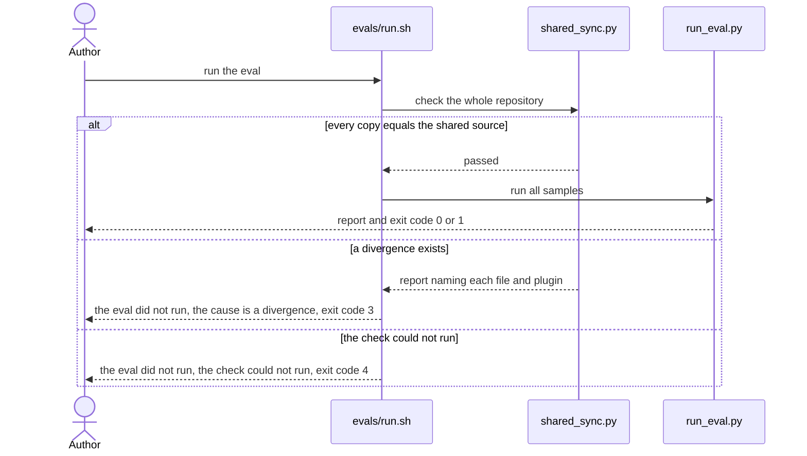
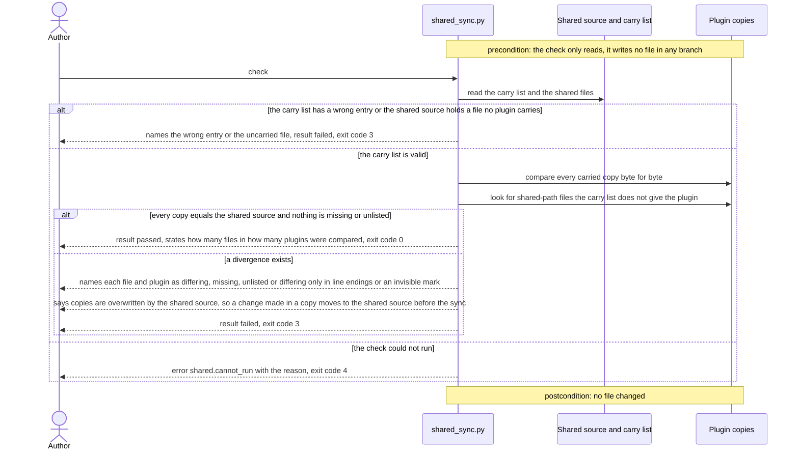

# Software Architecture Document — shared-detector

## 1. Introduction and goals

**Intent.** The plugin author edits each shared file in one place (a shared source) and brings every plugin copy up to date in one run, with the run listing what it rewrote. Any divergence between a plugin copy and the shared source is reported, with the file and the plugin named, before the copies can be committed or measured by the eval. A text author who installs any of the three text plugins gets the same files on the same paths and the same detector results as before the step.

**Top-3 quality goals (1-liners; full scenarios in §10):**

1. **Completeness of detection** — every one of the 4 divergence kinds (differing, missing, unlisted, differing only in line endings) is caught and reported with the file and the plugin named.
2. **Safety of writes** — the sync is idempotent, writes byte for byte, writes only to plugin copies named in the carry list, and never deletes a file.
3. **Unchanged behaviour and portability** — the eval runner, its unit tests and every installed plugin behave as before; each command takes ≤ 2 s; only the standard library, on each interpreter the eval entry point already probes.

**Stakeholders.**

| Role | Interest | Sign-off owner? |
|---|---|---|
| Plugin author | Edits the shared source, runs the sync and the divergence check, commits | No |
| Text author | Installs a plugin and expects it to work as before; does not run the tooling | No |
| Tech Lead | SAD approval | Yes |

## 2. Constraints

**Technical.**
- Python 3, standard library only, with no import outside it. The code is written to run on Python 3.8 or newer: the repository pins no minimum, the local interpreter is 3.12.10, and no module newer than 3.8 is used (no `tomllib`, no `match`). The interpreters are the three that `evals/run.sh` already probes, in this order: `python3`, `python`, `py`.
- Bash for `evals/run.sh` and the before-commit step (Git Bash on Windows); Git 2.9 or newer, because the before-commit step is activated through `core.hooksPath`.
- Layout convention of the repository: a plugin is `plugins/<name>/skills/<name>/`; the skill folder carries the shared files at fixed paths inside it (`scripts/`, `references/`).
- No datastore: the only state is files in the repository.
- No CI and no dependency manifest in the repository; nothing is installed to run the tooling.

**Organisational.**
- Size S: about 2 to 5 PRs, about one week.
- No deadline is set in the spec.
- One maintainer, who is also the reviewer: Ihor Furman, the plugin author.

**Conventions.**
- Commit prefixes as in `git log`: `feat`, `fix`, `chore`, `test`, `docs`, `design`, with a scope or without. Identifiers, test names and commit messages are in English; comments and docstrings are in Ukrainian, as in the existing `evals/run.sh` and `evals/run_eval.py`; the README and product texts are in Ukrainian.
- Tests are `unittest` tests run with `python -m unittest discover <dir>`; the 74 existing tests in `evals/tests/` and the eval runner `evals/run_eval.py` are not changed.
- Machine lines of the output follow the eval runner: `error <code>: <message>` and a final `result: <passed|failed>` line, in English.

**Regulatory / external.**
- None. Every file involved is committed to a public repository and holds no personal data (spec §6.1).

## 3. Context and scope

The marketplace ships three text plugins that each carry their own physical copy of the same shared files, because an installed plugin is a copy of its own folder. This feature adds the tooling that keeps those copies equal to one shared source: a sync that rewrites them, and a divergence check that fails when they differ. It sits between the plugin author and the plugin folders; the text author only sees its result, as unchanged plugins.

<!-- brownfield: architecture-map.md (reflects_commit e6a83b1, plugins unchanged since): 4 plugins under plugins/, one skill each, no shared source, no CI, two entry points of the eval (`python evals/run_eval.py` and `bash evals/run.sh`), of which only `run.sh` will run the check -->

**External systems (in / out):**

| Actor or system | Type | Interaction |
|---|---|---|
| Plugin author | Person | Edits the shared source, runs the sync and the divergence check, runs the eval, commits |
| Text author | Person | Installs a plugin through Claude Code; never touches the tooling |
| Git | System (external) | Runs the before-commit step; holds the content being committed |
| Claude Code | System (external) | Installs and loads the plugin folders from the marketplace |
| Eval entry point | System (internal, existing) | Runs the divergence check first, then the eval runner, which is unchanged |
| Plugin folders | System (internal, existing) | Hold the plugin copies; the only place the sync writes |

**C4 Context (L1):**



## 4. Solution strategy

**Target surface.** `cli` (`target_surfaces: [cli]` in the frontmatter): a console application with two commands, `check` and `sync`, flags and exit codes. The before-commit hook and `evals/run.sh` are thin callers of that one command, not surfaces. One surface, so there is no multi-surface ADR and no UI-architecture decision.

**Top strategic choices (the seeds for ADRs):**

1. **One plan, two commands.** The core builds a plan from three inputs: the shared source, the carry list and a tree of plugin copies. `check` renders the plan and never writes. `sync` validates the carry list first, then applies the plan, then renders it. Both use the same comparator, so the sync can never write something the check would still call a divergence, or call «up to date» something the check would fail. Serves quality goals 1 and 2.
2. **Exact bytes.** Content is compared and written as bytes, with no normalisation of line endings or invisible marks (spec AC-12), and the sync never deletes a file, so an unlisted file is reported and left for the author (decided 2026-10-05, spec §8). A committed `.gitattributes` pins `eol=lf` for the shared source and the plugin copy paths, so an editor or `core.autocrlf` setting rarely causes a difference in line endings; the check still reports one when it happens. Serves quality goal 2.
3. **Three entry points, one exit-code contract.** The on-demand command, `evals/run.sh` and the before-commit hook all call the same command and read the same codes: 0 equal, 3 divergence or wrong carry list, 4 the check could not run. A check that could not run is never read as a pass. The eval entry point stops before any sample on any non-zero code and ends with 3 or 4, never with the exit code 0 or 1 that the runner uses. Serves quality goals 1 and 3.
4. **The before-commit step judges the staged content, not the working folder.** The core reads content through a tree reader with two implementations, the working folder and the Git index → [ADR-0001](adr/0001-read-staged-content-from-the-git-index.md). Serves quality goals 1 and 2.
5. **The hook ships in the repository and is switched on once per clone.** A committed `.githooks/pre-commit` activated by `git config core.hooksPath .githooks` → [ADR-0002](adr/0002-ship-the-hook-in-githooks-with-core-hookspath.md). Serves quality goal 1 without adding a dependency (goal 3).
6. **The shared source mirrors the in-skill paths, and the carry list is data.** `shared/` holds the five files at the path they have inside a skill folder, and `shared/carry.json` maps each path to the plugins that carry it → [ADR-0003](adr/0003-mirror-in-skill-paths-under-shared-with-a-json-carry-list.md). Serves quality goals 1 and 3 (no file added to any plugin).

Each tactical decision in later sections should trace to one of these seeds. Tactical decisions that *contradict* a strategic choice are red flags — surface them in §11.

## 5. Building block view

There is no layering to speak of: the product is one Python command made of pure functions (read a tree, load the carry list, build a plan, render it, apply it) behind a thin argument parser, plus two short Bash callers. This matches the repository, where the only code beside the detector is the eval runner, a single script with pure judging functions and a thin `main`. The plan is a plain value, so the check, the sync and the tests all consume the same thing.

**Internal decomposition:**

```
shared/                         the shared source (new)
├── carry.json                  which plugin carries which shared file
├── scripts/analyze.py
└── references/                 ai-markers.md, lexicon.md, style-toolkit.md, syntax-figures.md
tools/                          (new)
├── shared_sync.py              check and sync: tree readers, carry list, plan, report, apply, exit codes
└── tests/test_shared_sync.py   unit tests for the 4 divergence kinds and the guards, plus one test on a real temporary Git repository
.githooks/pre-commit            Bash: runs `check --staged` before every commit (new)
.gitattributes                  `eol=lf` for shared/ and the plugin copy paths: plugins/*/skills/*/scripts/analyze.py and the four references/ files (new)
evals/run.sh                    Bash: runs `check` first, then the eval runner (extended)
evals/run_eval.py, evals/tests/ unchanged
plugins/<p>/skills/<p>/...      the plugin copies, on the same paths as before
```

**C4 Container (L2):**



## 6. Runtime view

Three flows are seeded here, one per entry point; the `sequences` stage then maps every acceptance criterion of the spec to a flow, a branch or an explicit N/A. Participants are the containers of §5.

**Critical flow 1: sync** (spec AC-01, AC-02, AC-03, AC-03b, AC-10)



**Critical flow 2: check before every commit** (spec AC-08, AC-08b)



**Critical flow 3: check at the start of the eval** (spec AC-07)



**Critical flow 4: check on demand** (spec AC-03c, AC-04, AC-05, AC-06, AC-10, AC-12)



**Coverage of the spec (use-case and acceptance-criteria passes).**

| User story | Flow |
|---|---|
| US-01 Fix a shared file once | 1 (the sync is the second half of editing in one place) |
| US-02 Bring every plugin up to date | 1 |
| US-03 Be told when copies differ | 4, 2, 3 |
| US-04 Be told on every path that matters | 4 (on demand), 3 (eval), 2 (commit) |
| US-05 Know who carries what | 4 (missing, unlisted, wrong carry list), 1 |
| US-06 Not lose a change made in a copy | 1 and 4 (the overwrite notice, AC-10); the documents are non-runtime |
| US-07 Keep installed plugins working | non-runtime, see AC-13 and AC-14 below |

| AC | Shown by |
|---|---|
| AC-01, AC-02 | Flow 1, the valid-carry-list branch (rewritten or created, or all up to date); the could-not-run branch (exit 4) has no AC of its own, it follows the exit-code contract of §8 |
| AC-03 | Flow 1, the wrong-entry branch |
| AC-03b | Flow 1, the opt branch for an unlisted file |
| AC-03c | Flow 4, the wrong-carry-list branch |
| AC-04 | Flow 4, the passed branch |
| AC-05, AC-12 | Flow 4, the divergence branch (the notice, and the line-endings and invisible-mark kinds) |
| AC-06 | Flow 4, the divergence branch (missing and unlisted kinds) |
| AC-07 | Flow 3 |
| AC-08, AC-08b | Flow 2 |
| AC-10 | Flow 1 (the sync overwrites only carried copies) and flow 4 (the copy is reported) |
| AC-09, AC-11 | N/A, non-runtime: README and architecture-map text, verified by reading them |
| AC-13 | N/A, non-runtime: a one-off acceptance run of the eval on each analyzer copy, compared with the committed table |
| AC-14 | N/A, non-runtime: a one-off comparison of the plugin folders before and after the step (`git diff --stat`) |

**Flags for `design` (not changed here).**

- The four flows use the §5 container names as participants (`shared_sync.py`, `evals/run.sh`, …) instead of the generic vocabulary, to stay consistent with the three flows seeded by `design`. This is a deliberate exception: for a `cli` feature the containers of §5 are the participants.
- No flow writes to a datastore, so there are no persist notes for `data-model`; the only state is files (§2). `data-model` has nothing to index.

## 7. Deployment view

<!-- N/A: nothing is deployed, the tooling runs on the plugin author's machine -->

The tooling has no deployment unit of its own. It runs on the plugin author's machine on demand, at the start of the eval and before a commit, and it ships inside the repository like the eval runner. Monitoring is the output and the exit code of each run; no threshold applies, because one run reads about 20 files.

## 8. Crosscutting concepts

| Concept | Convention | Where defined |
|---|---|---|
| Logging | None: no log file. A run prints its report to stdout and errors to stderr. | here |
| Report format | English lines `error shared.<code>: <file> <plugin> <detail>` for each finding, ending with `result: passed` or `result: failed`. Codes: `shared.differing`, `shared.line_endings`, `shared.missing`, `shared.unlisted`, `shared.orphan_source`, `shared.carry_entry`, `shared.cannot_run`. A copy that differs only in an invisible mark has no code of its own: it is `shared.differing` with the detail saying so (decided 2026-10-05). The notice that copies are overwritten by the shared source is printed whenever a copy differs. | `evals/run_eval.py` (`eval.*` codes) |
| Exit codes | `check`: 0 every copy equals the shared source and matches the carry list; 3 any divergence or a wrong carry list; 4 the check could not run. `sync`: 0 every copy equals the shared source after the run; 3 stopped by a wrong carry list, or an unlisted file or a shared file that no plugin carries remains (the sync validates both before it writes and never says «up to date» while either exists); 4 could not run. Any unexpected exception is caught in `main` and exits 4, because the Python default 1 would be read by the eval as a failed band. | here |
| Error handling | Guard clauses return a finding, not an exception; the plan is a plain value that the report renders. | `evals/run_eval.py` |
| Authentication / authorization | N/A. The only write boundary: the sync writes only to `plugins/<p>/skills/<p>/<shared path>` for entries of the carry list that passed validation; an absolute path, a path with `..` or one that leaves the plugin folder is rejected before anything is written. | spec §6.1 |
| Paths and bytes | Paths in `carry.json` are relative with forward slashes. Files are read and written as bytes with no line-ending translation; `.gitattributes` pins `eol=lf` for the shared source and the plugin copy paths, so Git does not translate them on checkout or on staging. A missing folder is created only inside the carrying plugin. | here |
| Write order | The whole carry list is validated first, then written. Each copy is written directly. An interrupted run can leave a short copy; the next check reports it and the next sync repairs it, because both are idempotent. | here |
| Interpreter lookup | `python3`, `python`, `py` in this order; the first that runs `-c "import sys"`. Identical in `evals/run.sh` and in the hook. When none works, the extended `evals/run.sh` prints a message and exits 4 (today it exits 1, which the eval would read as a failed band), and the hook refuses the commit (AC-08b). | `evals/run.sh` |
| ID strategy / events / internationalisation | N/A. The report is English like the eval report; the README is Ukrainian. | — |

## 9. Architecture decisions

| # | Title | Status | Section |
|---|---|---|---|
| 0001 | Read the staged content from the Git index in the before-commit check | Accepted | §4 |
| 0002 | Ship the before-commit hook in a committed `.githooks` folder activated through `core.hooksPath` | Accepted | §4 |
| 0003 | Mirror the in-skill paths under `shared/` and list the carriers in `shared/carry.json` | Accepted | §4 |

ADR files live under `docs/features/shared-detector/adr/NNNN-<title>.md`.

## 10. Quality requirements

Each top-3 goal from §1 expanded into a full scenario. Numbers are copied from spec §6.

**QG-1. Completeness of detection**
- **When:** a plugin copy differs from the shared source, is missing although the carry list requires it, is a file at a shared path that the carry list does not give that plugin, or differs only in line endings.
- **Then:** the check fails and names the file and the plugin; each of the 4 kinds is caught by at least 1 automated test.
- **How verify:** one unit test per kind on an in-memory tree; one integration test on a real temporary Git repository for the index reader (ADR-0001), including a copy that is fixed in the working folder but staged with a divergence; tests of exit codes 3 and 4 for `evals/run.sh`.

**QG-2. Safety of writes**
- **When:** the sync runs on the current files, again right after a sync, and on a repository where a plugin holds a shared file that the carry list does not give it.
- **Then:** the first sync on the current files rewrites 0 files; the second sync in a row rewrites 0 files; the sync writes only into copies named in the carry list; it deletes 0 files, leaves the unlisted file in place, exits 3 and does not say that all copies are up to date.
- **How verify:** a unit test that counts writes on an in-memory tree; a carry list entry such as `../x` makes the sync write nothing; a test that an unlisted file survives the sync and the sync exits 3; the output of two runs in the repository.

**QG-3. Unchanged behaviour and portability**
- **When:** the step is complete and the tests and timings are run.
- **Then:** 0 changed lines in the eval runner and in its unit tests; 74 of 74 existing unit tests pass; the check takes ≤ 2 s and the sync takes ≤ 2 s for 5 shared files in 3 plugins; it works with each of the 3 interpreters the eval entry point probes, as far as they are present, with 0 imports outside the standard library.
- **How verify:** `git diff --stat` shows no change under `evals/run_eval.py` and `evals/tests/`; `python -m unittest discover evals/tests`; a timed standalone run on the plugin author's Windows shell with each present interpreter.

## 11. Risks and technical debt

| Risk / debt | Severity | Mitigation | Owner |
|---|---|---|---|
| The sync silently erases a change the plugin author made directly in a plugin copy in order to measure it with the eval | Medium | The divergence report says copies are overwritten by the shared source (AC-05); the README and the architecture map name `shared/` as the place to edit (AC-11) | Plugin author |
| The before-commit step is never set up, or is bypassed with `git commit --no-verify` | Medium | The on-demand check and the eval entry point still report; the README states this limit (AC-09) | Plugin author |
| A direct run of `run_eval.py` skips the divergence check | Low | The README and the architecture map name `evals/run.sh` as the only checked eval path (AC-11) | Plugin author |
| Under `core.autocrlf` (here `input`, the Git for Windows default `true`) the staged check and the working-folder check can disagree on line endings (consequence of ADR-0001) | Medium | `.gitattributes` pins `eol=lf` for the shared source and the plugin copy paths, which removes the usual cause; a difference in line endings that still appears has its own code `shared.line_endings`; the README states which content each entry point judges. Residual risk: a path missing from `.gitattributes` | Plugin author |
| `core.hooksPath` hides any other hook kept in `.git/hooks/` of that clone (consequence of ADR-0002) | Low | The README mentions it in the setup step | Plugin author |
| Copies installed on text authors' machines stay old until plugin versions change | Medium | Outside this step (spec §3); see the versions open question below | Plugin author |
| An interrupted sync leaves a short plugin copy | Low | The next check reports it and the next sync repairs it, because both are idempotent (§8) | Plugin author |
| Decided 2026-10-05: the sync does not delete a file a plugin holds that the carry list does not give it | Closed | The sync deletes nothing and only warns; the check reports the file and the plugin author deletes it, because a deletion cannot be undone by the sync | Ihor Furman |
| Open architectural decision: should plugin versions change when a shared file changes | Open question | Resolve before the first release after this step; now no | Ihor Furman |
| Decided 2026-10-05: the divergence check is not added to `run_eval.py` | Closed | Three entry points only (on demand, `evals/run.sh`, before every commit); the runner stays unchanged and a direct run of it is unchecked, which the README and the architecture map state (AC-11) | Ihor Furman |
| Decided 2026-10-05: the repository pins line endings through `.gitattributes` with `eol=lf` for `shared/` and the plugin copy paths | Closed | The check still reports a difference in line endings as a divergence (AC-12); the pin makes it rare | Ihor Furman |

**Accepted debt (acceptable in v1, plan to fix later):**
- 12 physical copies of 5 files in 3 plugins remain, because an installed plugin is a copy of its own folder and symlinks are unreliable on Windows. The sync makes the duplication cheap to maintain; it does not remove it.
- A plugin copy is written directly, without a temporary file.
- The check proves that the copies in the repository are equal, not that the copies installed on text authors' machines are current.

## 12. Glossary

| Term | Meaning |
|---|---|
| Carry list | The list that says which plugins carry which shared file (`shared/carry.json`). Not what a plugin actually holds on disk; a difference between the two is a divergence. |
| Divergence | A plugin copy that differs from the shared source, or is missing although the carry list requires it, or a file a plugin holds at the path of a shared file that the carry list does not give it. Not a band failure of the eval. |
| Divergence check | The `check` command: fails when any divergence exists, names each file and plugin, and never changes a file. |
| Plugin copy | The physical copy of a shared file inside one plugin, the one an installed plugin reads. Not the shared source. |
| Shared file | A file that several plugins carry with identical content. Not the skill description file, which differs in every plugin. |
| Shared source | The one editable reference version of the shared files (`shared/`), from which every plugin copy is made. Nothing installed reads it. |
| Sync | The `sync` command: rewrites every diverged plugin copy from the shared source and lists what it rewrote. Not the divergence check. |
| Plugin author | The person who maintains the marketplace plugins and runs the checks. Not a text author. |
| Text author | The person who installs the plugins and checks or edits their own Ukrainian texts. Not a plugin author. |
| Staged content | The versions of files in the Git index, which are the content about to be committed. Not the files in the working folder. Not yet in `CONTEXT.md`; a candidate for `/sdd:glossary`. |
| Tree reader | The part of the tooling that lists paths and reads bytes of a tree, with one implementation for the working folder and one for the Git index (ADR-0001). A design term, not a domain term. |
| Plan | The value that the core builds from the shared source, the carry list and a tree of plugin copies, and that the check and the sync both render. A design term, not a domain term. |

