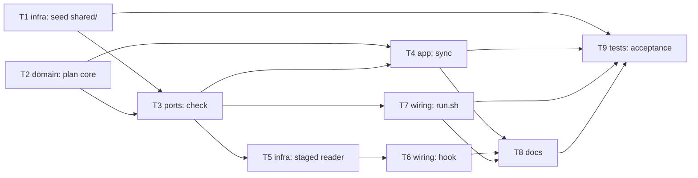

# Epic — shared-detector

> **Spec:** [spec.md](../spec.md) · **Design:** [sad.md](../sad.md) · **Data model:** none (no schema, no datastore) · **API:** [cli.md](../contracts/cli.md) · **ADRs:** [adr/](../adr/)

## Goal

The plugin author edits each shared file once in `shared/` and brings every plugin copy up to date with one `sync`; any divergence is reported with the file and the plugin named, on demand, at the start of the eval and before every commit. Text authors see no change: same files on the same paths, same detector results (spec §2 Goals).

## Scope

- **In:** `shared/` (five files + `carry.json`), `.gitattributes`, `tools/shared_sync.py` with `check`, `check --staged` and `sync`, `.githooks/pre-commit`, `evals/run.sh` (check first, exit 3/4), README and architecture map text, a one-off acceptance run.
- **Out:** changing detector rules or the content of any shared file; changing `evals/run_eval.py` or its tests; a server pipeline; installed plugins reading `shared/` at run time; sharing the skill description files; forcing the hook; plugin version bumps (spec §3, §8).

## Task map

Waves: 1 — T1 ∥ T2 · 2 — T3 · 3 — T4, T5, T7 (T4/T5 share `tools/shared_sync.py` and are serialized; T7 is parallel) · 4 — T6 · 5 — T8 · 6 — T9.

## Tasks

See [tracker.md](./tracker.md) for status. Machine contract: [tasks.json](../tasks.json).

| # | Task | Layer | Blocked by | DoD (short) |
|---|---|---|---|---|
| T1 | Seed shared/, carry.json, .gitattributes | infra | — | 12 copies byte-identical to `shared/`, LF pinned, plugins untouched |
| T2 | Plan core: reader interface, carry validation, comparator | domain | — | 4 divergence kinds and carry guards caught in unit tests, no write |
| T3 | `check` command, report, exit codes 0/3/4 | ports | T1, T2 | real repo passes with `checked 12 files in 3 plugins`; 3/4 paths tested |
| T4 | `sync` command | app | T2, T3 | rewrites only diverged copies, idempotent, deletes nothing |
| T5 | Git index reader, `check --staged` | infra | T3 | staged vs working-folder integration test on a real temp repo |
| T6 | `.githooks/pre-commit` | wiring | T5 | refuses divergence and «could not run», allows clean commit |
| T7 | `evals/run.sh` runs the check first | wiring | T3 | divergence → exit 3, cannot run → exit 4, runner untouched |
| T8 | README + architecture map | docs | T4, T6, T7 | setup, limit, commands, shared source, checked eval path named |
| T9 | Acceptance run | tests | T1, T4, T7, T8 | AC-13/AC-14 recorded, 74/74 tests, NFRs measured |

## Risks / Hard rules

- Python 3.8+, standard library only; comments in Ukrainian, identifiers and messages in English (sad §2).
- `check` writes nothing in any branch; `sync` writes only validated carry-list targets and never deletes (sad §8, §10 QG-2).
- Exit codes 0/3/4 only; the Python default 1 is never returned, so the eval can tell a divergence from a failed band (sad §8).
- 0 changed lines in `evals/run_eval.py` and `evals/tests/` (spec §6).
- Compile-coupling: none (no statically-checked shared interface), but T2–T5 share `tools/shared_sync.py` and are serialized by `files_hint` overlap.
