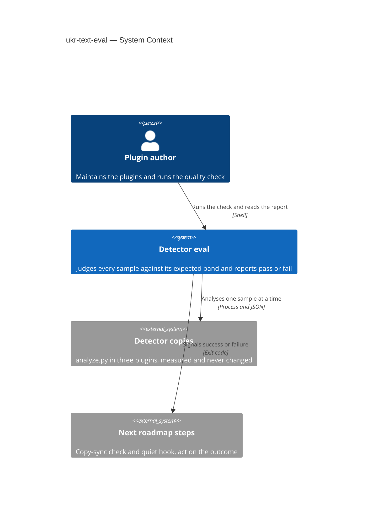
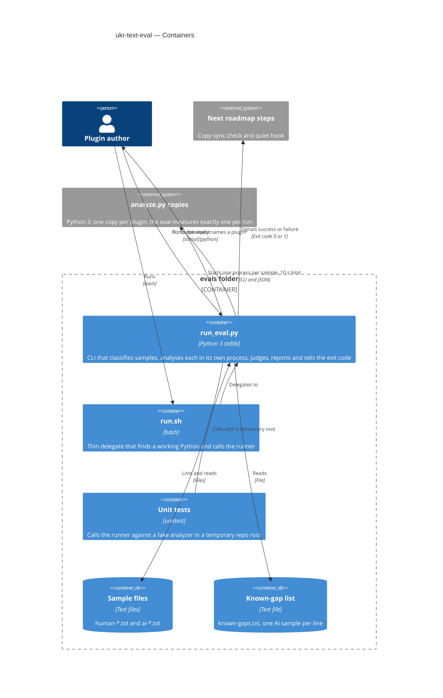
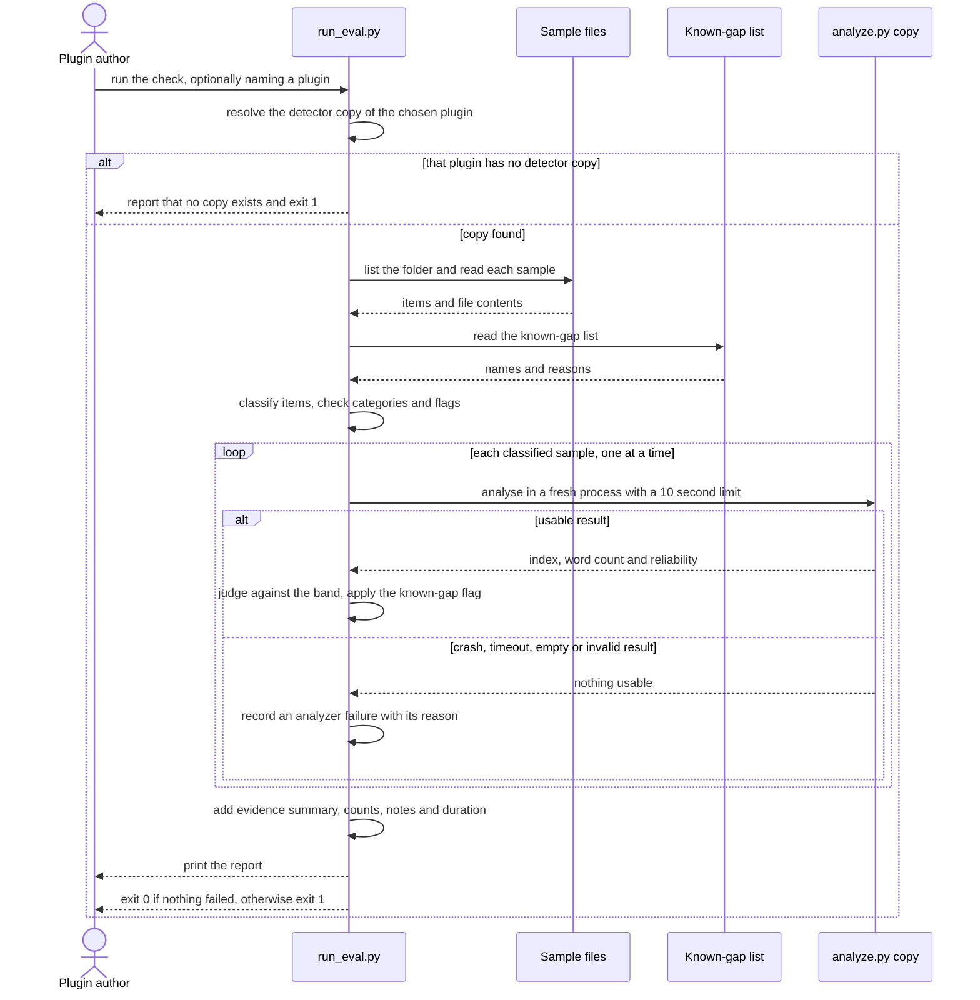

# Software Architecture Document — ukr-text-eval

## 1. Introduction and goals

**Intent.** Give the plugin author a one-command check that runs every sample in `evals/samples/` through a chosen detector copy and compares each index with an expected band for its category, so that honest human texts are shown to stay out of the suspicious zone and a failing run names the sample and the reason. The check measures the detector; it never changes detector rules.

**Top-3 quality goals (1-liners; full scenarios in §10):**

1. **Verdict integrity** — an analyzer failure never looks like a low index, samples never affect each other, and two runs on the same inputs agree (spec §2, §6, US-05, US-08).
2. **Honest evidence** — every sample file appears in the report, false alarms are named, and the report states how far its evidence reaches (spec §2, §7).
3. **Fast and portable** — one command, a verdict within seconds, identical on the author's Windows shell and on a POSIX shell, and adding a sample needs no change to the bands (spec §6).

**Stakeholders.**

| Role | Interest | Sign-off owner? |
|---|---|---|
| Plugin author | Runs the check, reads the report, maintains samples and the known-gap list | No |
| Text author | Indirect: the check fails whenever a human sample is labelled suspicious, so the detector is not shipped with false accusations of people | No |
| Tech Lead | SAD approval | Yes |

<!-- Decision overrides (¶4) — none. -->

## 2. Constraints

**Technical.**
- Python 3, standard library only, as the rest of the repo; the repo pins no minimum version and the author's machine runs 3.12.10, so the runner avoids version-specific syntax.
- Runs in a Windows shell (PowerShell or cmd) and in a POSIX-compatible shell (Git Bash) with identical verdicts (spec §6 Platforms). On the author's Windows machine `python3` is a Microsoft Store stub that does not run, while `python` works.
- The analyzer is a black box with a fixed CLI: `analyze.py <file> --json` prints a JSON object with Ukrainian keys `індекс`, `надійність_статистики` and `метрики.слів` (`plugins/ukr-text-guard/skills/ukr-text-guard/scripts/analyze.py:513`). Three byte-identical copies exist, one per plugin. The runner may not change them.
- No datastore, no network, no accounts; the inputs are text files on disk.
- Without `PYTHONUTF8=1` the analyzer prints its JSON in the local console encoding when piped on Windows, so the runner must force UTF-8.

**Organisational.**
- No deadline or effort budget is quoted in the spec; the feature is sized S (about one week, 2–5 PRs) and has a single maintainer.
- This step is wave 1 of the roadmap and blocks steps 2, 3 and 4.

**Conventions.**
- `docs/architecture-map.md`: samples are named `human-*` or `ai-*` in kebab case; conventional commit prefixes; product content and the README are Ukrainian.
- Pipeline documents for this feature are written in English (`artifact_language: en`), and so is the runner's report.
- No CI, no test runner and no dependency manifest exist today.

**Regulatory / external.**
- Data classification is internal, but the repository is public, so committed samples become public. Texts by other authors need their permission before they are committed (spec §6.1).
- No authorization boundary; the security review is N/A (spec §6.1).

## 3. Context and scope

The plugin author wants to know whether the detector gives Ukrainian text a sensible index. Today `evals/run.sh` prints one line per sample and asserts nothing. The new check runs each sample through one plugin's detector copy, judges it against a band fixed before the run, prints a report and returns an exit code that the next roadmap steps (copy-sync check, quiet hook) can act on without reading the report.

<!-- brownfield: scanned from docs/architecture-map.md (reflects 747953a, fresh) — evals/ holds run.sh and 10 samples, analyze.py has three identical copies, no tests or CI exist -->

**External systems (in / out):**

| Actor or system | Type | Interaction |
|---|---|---|
| Plugin author | Person | Runs the check, optionally names a plugin, reads the report, edits samples and the known-gap list |
| Detector copies (`analyze.py` in ukr-text-guard, ukr-text-detector, ukr-text-editor) | System (internal, measured not changed) | Called as a separate process once per sample, one copy per run |
| Next roadmap steps (copy-sync check, quiet hook) | System (internal, future) | Read the exit code, 0 or 1 |

**C4 Context (L1):**



## 4. Solution strategy

**Target surface.** `cli` — a command-line script the plugin author runs; `target_surfaces: [cli]` in the frontmatter. A single surface, so no multi-surface decision and no UI-architecture decision. Data files are not surfaces.

**Top strategic choices (the seeds for ADRs):**

1. **Judge every sample in isolation and fail closed** — the runner starts a fresh analyzer process per sample, one after another, with a 10 s limit and UTF-8 forced on both ends. A crash, a timeout, an empty or unreadable result, or a missing field is an analyzer failure with a reason, never a low index (AC-09). Separate processes also keep the analyzer's module-level state from leaking between samples (AC-10) and give a hard timeout, which an in-process call cannot. Importing `analyze()` directly is excluded by AC-09 and AC-10, so this is not an ADR.
2. **Fix the bands before the run, take the category from the file name, excuse only by explicit entry** — bands are named constants in the runner, a sample is human or AI by its `human-` or `ai-` prefix, and a known-gap is a line in `evals/known-gaps.txt` that can name only an existing AI sample → [ADR-0001](adr/0001-keep-known-gaps-in-a-plain-list-file.md).
3. **Report for people, exit code for machines** — the report is plain text on stdout, and the outcome is exit code 0 or 1 only; notes (drift warning, gap may be closed, inconclusive) never change it (AC-19). A crash of the runner itself also exits 1 → [ADR-0002](adr/0002-signal-the-outcome-by-exit-code-only.md).
4. **Keep the judging core pure and separate from I/O** — one function takes a category, a known-gap flag and an analyzer result and returns a verdict. It is tested without any process, and the process-spawning part is tested against a fake analyzer in a temporary repo root (`--root` is the seam).

Each tactical decision in later sections traces to one of these seeds.

## 5. Building block view

The check is one flat Python module inside the existing `evals/` folder; no layering framework is warranted for a script of a few hundred lines. Inside it the pure judging function is kept apart from the parts that touch files and processes (strategy seed 4). `evals/run.sh` stays as a thin delegate so the documented command `bash evals/run.sh` keeps working: it tries `python3`, `python` and `py`, checks that the candidate really starts, and hands over to the runner. Verdicts live only in `run_eval.py`.

**Internal decomposition:**

```
evals/
├── run_eval.py       # CLI and the whole check: discover, classify, analyse, judge, report, exit code
├── run.sh            # thin delegate: finds a working Python, calls run_eval.py
├── known-gaps.txt    # one AI sample name per line, optional "# reason" (ADR-0001)
├── samples/          # human-*.txt and ai-*.txt, unchanged
└── tests/
    └── test_run_eval.py   # unittest, fake analyzer in a temporary repo root
```

**C4 Container (L2):**



## 6. Runtime view

Design seeds the primary flow. The `sequences` stage then maps every acceptance criterion to a flow, a branch or an explicit N/A.

**Critical flow 1: run the check against one detector copy**



**Critical flow 2: event propagation** — <!-- N/A: no events, no async work; the runner is a synchronous script -->.

## 7. Deployment view

<!-- N/A: not deployed — a local script run by the plugin author in a shell, reusing the existing evals folder with no infra change; where the check runs in CI is the roadmap's open decision D2 -->

The runner runs on the author's machine only. Its run time is printed in the report (spec §6, ≤ 60 s for up to 50 samples; the ten current samples take about 1 s).

## 8. Crosscutting concepts

| Concept | Convention | Where defined |
|---|---|---|
| Logging | None. The stdout report is the only output; no log files | here |
| Error handling | Every failure kind (analyzer failure, unclassified item, bad known-gap entry, missing category, missing detector copy, miss, false alarm) is a report line naming the sample and the reason and makes the run fail. An unhandled exception in the runner is caught at the top level, printed as «runner error» and exits 1. Nothing ends in exit 0 except an explicit success | here, ADR-0002 |
| Exit code | 0 = nothing failed, 1 = anything else. Warnings, drift notes, gap-may-be-closed and the inconclusive mark are notes and never change it (AC-19) | ADR-0002 |
| Encoding | The child gets `PYTHONUTF8=1` and its stdout is decoded as UTF-8 bytes. The runner's own stdout is reconfigured to UTF-8 with `errors="replace"`. Sample files are read as bytes, decoded as UTF-8 with replacement (as the analyzer does), and scanned for a byte-order mark or invisible characters, for which a note says a high index may come from the file rather than the text (spec §8 OQ-3 default) | here |
| Configuration | `--plugin NAME`, default `ukr-text-guard`. `--root DIR`, default the repo root derived from the script's own location, exists as the test seam. Bands and limits are named constants in `run_eval.py`: human max 25, human drift warning above 15, AI min 26, informational high level 51, reliable length 150 words, 10 s per sample | here, ADR-0001 |
| Determinism | Samples are processed in sorted name order, with no randomness and no timestamps in the report except the duration line | here |
| Portability | Paths via `pathlib`, the child is started with an argument list and no shell, the interpreter is `sys.executable` | here |
| ID strategy | N/A — the sample's file name without `.txt` is its identifier | — |
| Authentication | N/A — local run, no accounts | — |
| Internationalisation | The report is English prose with the spec's English terms; sample names and analyzer text are passed through untouched | here |
| Observability | The report prints the plugin used, the duration, per-category counts, ignored items and the evidence summary | here |
| Events | N/A | — |

## 9. Architecture decisions

| # | Title | Status | Section |
|---|---|---|---|
| 0001 | Keep known-gaps in a plain list file | Accepted | §4 |
| 0002 | Signal the outcome by exit code only | Accepted | §4 |

ADR files live under `docs/features/ukr-text-eval/adr/NNNN-<title>.md`.

## 10. Quality requirements

Each top-3 goal from §1 expanded into a full scenario. Numbers come verbatim from spec §6.

**QG-1. Verdict integrity**
- **When:** the same samples are run twice in a row, alone, together with others and in reverse order, or an analyzer run hangs, crashes or returns an unusable result.
- **Then:** two consecutive runs on the same inputs give identical indexes and verdicts, 100%; each sample's verdict is identical when it is run alone, together with the others, and in reverse order, 100%; a sample that gets no result within 10 s is reported as an analyzer failure and never as a low index.
- **How verify:** a unit test calls the per-sample path in three orders and compares verdicts; a test uses a fake analyzer that sleeps past 10 s, one that crashes and one that prints nothing; a diff of two consecutive reports differs only in the duration line.

**QG-2. Honest evidence**
- **When:** the sample folder holds classified samples, unclassified files, non-text files and subfolders, and the human samples are short.
- **Then:** 100% of sample files appear in the report, as classified, unclassified or ignored; per-category counts plus ignored items sum to the number of items in the folder; every run states how many human samples reach 150 words out of how many, and marks the human conclusion inconclusive unless all of them do.
- **How verify:** a unit test builds a folder with each kind of item and asserts that the counts sum to the number of items; a test with short human samples asserts the inconclusive mark; the first run on the real folder is read against the spec's KPIs «False alarms named» and «Evidence disclosed».

**QG-3. Fast and portable**
- **When:** the author runs the check over up to 50 samples in PowerShell and in Git Bash, and adds a sample of a known category.
- **Then:** one run of one detector copy over up to 50 samples takes ≤ 60 s, shown by the duration printed in the report; verdicts are identical in the Windows shell and in a POSIX-compatible shell, 2 of 2; adding a sample needs 0 edits to expected bands.
- **How verify:** the printed duration on the real folder; one run in each shell before release with the verdict lines compared; the diff of the commit that adds a sample leaves the band constants in `run_eval.py` unchanged.

## 11. Risks and technical debt

| Risk / debt | Severity | Mitigation | Owner |
|---|---|---|---|
| The human set is 2 samples by one author, of 24 and 16 words, so a green run proves little | High | Every run prints the evidence summary and marks the human conclusion inconclusive (AC-08); roadmap step 3 broadens the set | Plugin author |
| `python3` on the author's Windows machine is a Store stub, so the current `evals/run.sh` cannot run there | Medium | The runner is started as `python` and starts the analyzer with `sys.executable`; `run.sh` probes interpreters and verifies each one starts | Plugin author |
| The runner reads the analyzer's Ukrainian JSON keys; a rename in a future tuning job would break it | Low | A missing key is an analyzer failure on every sample (AC-09), so the break is loud, not silent | Plugin author |
| A known-gap line can excuse a real regression | Medium | Every known-gap is listed with its reason in every report (AC-07), a flag on a human sample is an error (AC-13), the list is reviewed in the diff (ADR-0001) | Plugin author |
| The analyzer itself crashes on degenerate input today (an empty file raises `ValueError`) | Low | Counted as an analyzer failure (AC-09); fixing it is a detector-rule change and out of scope (spec §3) | Plugin author |
| A byte-order mark or invisible characters in a saved file can raise the index by themselves | Low | A per-sample note says so (spec §8 OQ-3 default); not fixed in this step | Plugin author |

**Accepted debt (acceptable in v1, plan to fix later):**
- The report is text only; no `--json` output. Add it with its own acceptance criteria when roadmap step 5 needs the numbers (ADR-0002).
- Samples are analysed one after another; fine for up to 50 samples, far inside the 60 s limit.
- The known-gap reason is optional and not enforced (ADR-0001).
- The eval measures one detector copy per run and does not prove the copies identical; roadmap step 4 owns that check (spec §3).

## 12. Glossary

| Term | Meaning |
|---|---|
| Bypass sample | An AI text deliberately written or reworked to look human and avoid detection; may or may not be flagged known-gap |
| Expected band | The range of index a sample of its category must fall into, set before a run |
| False alarm | A human sample that received an index above the human band |
| Index | The score from 0 to 100 the detector gives a text; the higher, the more signs of AI writing |
| Known-gap | A flag the plugin author puts on an AI sample the detector is known to miss; it never fails a run and can never be put on a human sample |
| Ordinary AI sample | An AI sample without a known-gap flag, which must reach the AI band |
| Plugin author | The person who maintains the marketplace plugins and runs the quality check |
| Reliability | The analyzer's own rating of how far the index can be trusted for a text of that length |
| Sample | One text file in the check set, labelled human or AI by its file name prefix |
| Text author | The person who installs the plugins and checks or edits their own Ukrainian texts |
| Analyzer failure | A sample whose analyzer run crashed, timed out, or returned an empty, unreadable or incomplete result; counted as failed and never shown as a low index (not yet in CONTEXT.md) |
| Detector copy | The `analyze.py` inside one plugin; three byte-identical copies exist and each run measures one (not yet in CONTEXT.md) |
| Unclassified sample | A plain text file in the sample folder whose name starts with neither `human-` nor `ai-`; reported and fails the run (not yet in CONTEXT.md) |
| Inconclusive | The mark on the human conclusion when fewer than all human samples reach 150 words (not yet in CONTEXT.md) |
| Drift warning | A note that a human sample is above 15 but within the human band of 25; never changes the outcome (not yet in CONTEXT.md) |
