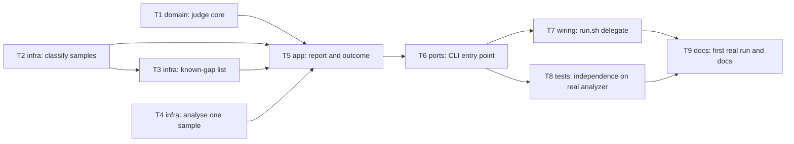

# Epic — ukr-text-eval

> **Spec:** [spec.md](../spec.md) · **Design:** [sad.md](../sad.md) · **CLI contract:** [cli.md](../contracts/cli.md) (no data model, no OpenAPI: `target_surfaces: [cli]`) · **ADRs:** [adr/](../adr/)

## Goal

Ship a one-command check that runs every sample in `evals/samples/` through a chosen detector copy, judges each index against a band fixed before the run, prints a report that names false alarms and states how far its evidence reaches, and ends with exit code 0 or 1. The plugin author can then tell in one run whether honest human texts stay out of the suspicious zone (spec §2).

## Scope

- **In:** `evals/run_eval.py` (judging core, folder scan, known-gap list, per-sample analysis, report, CLI), `evals/run.sh` delegate, `evals/known-gaps.txt`, `evals/tests/test_run_eval.py`, and two docs touch-ups (`docs/architecture-map.md`, `CONTEXT.md`).
- **Out (spec §3):** changing detector rules or thresholds, making bypass samples pass or fail, growing the human sample set, publishing the table in the README, fixing byte-order-mark false alarms, exact-score equality between plugin copies.

## Task map

Logical parallelism: T1, T2 and T4 have no dependencies, and T7 runs beside T8. Physically, T1–T6 and T8 all edit `evals/run_eval.py` or `evals/tests/test_run_eval.py` (the SAD keeps the check as one flat module), so `implement` serializes them in one lane in id order; only T7 (`evals/run.sh`) and T9 (docs) leave that lane.

## Tasks

See [tracker.md](./tracker.md) for status. Machine contract: [tasks.json](../tasks.json).

| # | Task | Layer | Blocked by | DoD (short) |
|---|---|---|---|---|
| T1 | Add the pure judging function and the band constants | domain | — | band boundary table tests pass; a flag never turns a failure into a pass |
| T2 | Discover and classify the items of the sample folder | infra | — | counts plus ignored equal the folder item total in every test folder |
| T3 | Read and validate the known-gap list, seed it with the first entry | infra | T2 | flag on AI sample only; missing and human names are `eval.bad_known_gap` |
| T4 | Analyse one sample in a fresh process and fail closed | infra | — | every failure branch has a fake-analyzer test; a hang ends as «timed out» |
| T5 | Build the report, the evidence summary and the outcome decision | app | T1, T2, T3, T4 | tests for AC-01, 02, 07, 08, 19 pass; notes alone give a passed run |
| T6 | Add the CLI entry point, detector copy lookup and exit code | ports | T5 | exit code is only 0 or 1; missing copy and forced exception exit 1 |
| T7 | Make run.sh a thin delegate that finds a working Python | wiring | T6 | `bash evals/run.sh` returns the runner's code in Git Bash |
| T8 | Prove independence and repeatability on the real analyzer | tests | T6 | three-order and two-run tests pass on the real folder |
| T9 | Verify the first real run on both shells and update the docs | docs | T7, T8 | PowerShell and Git Bash verdict lines identical; docs updated |

## Risks / Hard rules

- Python 3 standard library only, no version-specific syntax; the child is started with an argument list, no shell, `sys.executable` and `PYTHONUTF8=1` (sad §2, §8).
- Only exit codes 0 and 1; notes never change the outcome (ADR-0002, AC-19).
- Bands are named constants in one place; adding a sample needs 0 edits to them (spec §6, ADR-0001).
- Detector copies and samples are never changed by this epic (spec §3).
- **Source disagreement:** spec §1 and ADR-0001 say the first run flags both `ai-engineered-humanity` and `ai-prompted-human-style`; `sad.md §6` (decided by the plugin author during `sequences`) says only `ai-prompted-human-style`, because `ai-engineered-humanity` already scores 29. T3 follows the SAD. Fix the spec and ADR text when convenient; the flows are unaffected.
- **Contract correction:** `cli.md §3` names the detector path `plugins/<NAME>/skills/ukr-text-guard/scripts/analyze.py`; on disk the skill folder carries the plugin's own name (`plugins/<NAME>/skills/<NAME>/scripts/analyze.py`). T6 uses the real path; re-run `/sdd:api ukr-text-eval` or edit `cli.md` to match.
- Open contract questions OQ-A (bad command line exits 1) and OQ-B (missing `known-gaps.txt` is an empty list) are applied as proposed in T6 and T3.
