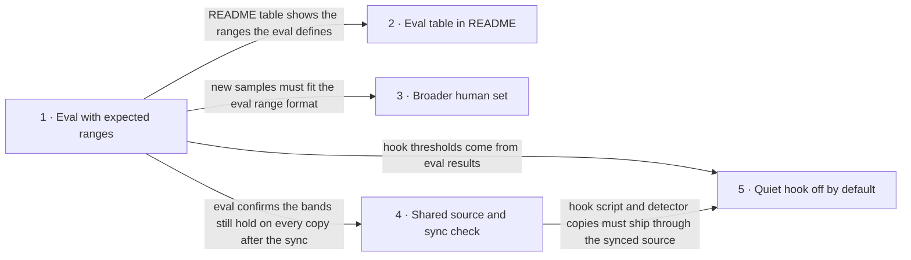

# Roadmap — ukr-text-guard

> **A decomposition, not a promise.** The overall idea broken into incremental steps: what each
> step is, where it comes from, how big it is — or that nobody has looked at it yet — and in which
> order, and parallel lanes, we walk them. **No dates** (except shipped history), **no scores** —
> order is the prioritization. The *solution* for any step lives in its `docs/features/<slug>/`
> spec, not here.

## Destination

The plugin author and Ukrainian-language writers can see from a measured eval how often the detector wrongly flags human text, while the three text plugins share one source of the detector and ship an optional quiet hook that stays off until the eval confirms its thresholds.

## Steps

| # | Step | Source | Size | Status |
|---|---|---|:---:|---|
| 1 | Run the eval against expected score ranges fixed before the run, and get a pass/fail report that lists false alarms on human texts and keeps bypass samples as known-gap → [spec](features/ukr-text-eval/spec.md) | `idea-brief.md` §7 Recommendation | S | spec'd |
| 2 | Show the eval table in the README with expected ranges and known-gap status, so users see measured quality | `idea-brief.md` §7 Recommendation | XS | idea |
| 3 | Broaden the human sample set across genres and authors, to reduce the one-voice risk | `idea-brief.md` §6 Risks | S | idea |
| 4 | Keep one reference copy of the shared detector files, copy it into each plugin by script, and fail the check when copies diverge | `idea-brief.md` §7 Recommendation | S | idea |
| 5 | Add a quiet hook, off by default, that suggests a check only on long Ukrainian texts with a high score, using thresholds taken from the eval | `idea-brief.md` §7 Recommendation | M | idea |

## Not yet specified

Nothing: every step could be stated precisely at this pass. Open questions are in the next sections.

## Out of scope

- Changing detector rules, weights or thresholds in this iteration — a separate large tuning job, and it would turn «measure» into «rewrite the detector». False alarms and misses the eval finds go into its report as known limitations for the next iteration (`idea-brief.md` §5 Out of scope).
- Making bypass samples (AI text reworked to evade detectors) a pass/fail requirement — they stay tracked as known-gap.
- Renaming or merging plugins and restructuring the marketplace — the plugin names are already installed by users.
- Turning the hook on by default.

## Open decisions

| # | Question | Type | Owner | Blocks |
|---|---|:---:|:---:|:---:|
| D1 | Where do human texts by other authors come from? | grilling | human | 3 |
| D2 | Where does the sync check run: before commit, in the eval run, or both? | grilling | human | 4 |
| D3 | Which minimum text length and which score keep the hook quiet? Closed by the results of step 1. | prototype | agent | 5 |
| D4 | Which plugin carries the hook? | grilling | human | 5 |

## Decisions so far

- Expected ranges are set before looking at detector output, so the eval tests the detector instead of mirroring it → [`idea-brief.md`](idea-brief.md) §6 Risks
- Exact equality of plugin copies is proven by step 4's own divergence check, while the eval checks only that the bands hold on each copy → [`spec.md`](features/ukr-text-eval/spec.md) §3 Non-goals
- Shared files are kept as one source plus a sync script, with a check that fails on divergence, because each installed plugin is a copy of its own folder → [`architecture-map.md`](architecture-map.md) Constraints
- Plugins can ship hooks (`hooks/hooks.json`) and reach their own files through `${CLAUDE_PLUGIN_ROOT}`; files outside the plugin folder are not reachable → [`plugins reference`](https://code.claude.com/docs/en/plugins-reference)
- A hook can read the reply text from the Stop event and show a non-blocking message; the alternative is the Write/Edit event with the file path → [`hooks reference`](https://code.claude.com/docs/en/hooks)

## Dependency graph

## Execution path

| Wave | Steps | Zone per step (why parallel-safe) | Unlocks |
|:---:|---|---|---|
| 1 | 1 | 1: `evals/` (runner and ranges) | 2, 3, 4 |
| 2 | 2 ∥ 3 ∥ 4 | 2: `README.md` · 3: `evals/samples/` · 4: `shared/` (new) and `plugins/` copies (disjoint) | 5 |
| 3 | 5 | 5: `plugins/ukr-text-guard/hooks/` (new) | — |

## Shipped

| Step | Shipped | Link |
|---|---|---|
